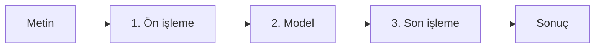
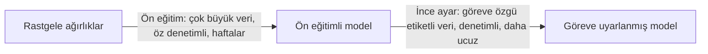
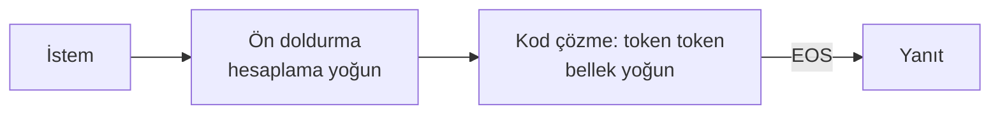

# Bölüm 1: Transformer Modellerine Giriş

**Doğal Dil İşleme (NLP) Dersi · Dr. Mesut Polatgil · NLP_2026**

Bu klasör, [Hugging Face LLM Course](https://huggingface.co/learn/llm-course/chapter1/1) 1. bölümü (*Transformer Models*) için takımımızın Türkçe dokümantasyonunu, uygulama kodlarını, zafiyet testlerini ve sınav materyalini içerir.

| Repo Kaptanı | Resmî Müfredat | Ana Depo | Çalışma Formatı |
|---|---|---|---|
| Himmet Can Umutlu | Hugging Face LLM Course, Bölüm 1 | [mesutpolatgil/NLP_2026](https://github.com/mesutpolatgil/NLP_2026) | Fork & PR · Slaytsız tahta savunması |

## İçindekiler

1. [Takım ve Görev Dağılımı](#takim)
2. [Klasör Yapısı](#klasor-yapisi)
3. [Ortam Kurulumu ve Çalıştırma](#kurulum)
4. [Ünite İçeriği (Kurs Sırasıyla)](#unite-icerigi)
   - [1/1 · Giriş](#k1-1) — Özge Sayınbaş
   - [1/2 · Doğal Dil İşleme ve Büyük Dil Modelleri](#k1-2) — Özge Sayınbaş
   - [1/3 · Transformer'lar neler yapabilir?](#k1-3) — Himmet Can Umutlu
   - [1/4 · Transformer'lar nasıl çalışır?](#k1-4) — Simay Evin
   - [1/5 · 🤗 Transformer'lar görevleri nasıl çözer?](#k1-5) — Himmet Can Umutlu
   - [1/6 · Transformer Mimarileri](#k1-6) — Simay Evin
   - [1/7 · Kısa sınav](#k1-7) — Sıla Taşan
   - [1/8 · LLM'lerle çıkarım](#k1-8) — Himmet Can Umutlu
   - [1/9 · Önyargı ve sınırlamalar](#k1-9) — Kadir
   - [1/10 · Ünite Özeti ve Transformer Cheat Sheet](#k1-10) — Özge Sayınbaş
   - [1/11 · Sertifika sınavı](#k1-11) — Sıla Taşan
5. [Türkçe Çeviri Arşivi](#ceviri-arsivi)
6. [Terim Sözlüğü](#terim-sozlugu)
7. [Kaynaklar ve Lisans](#kaynaklar)

---

<a id="takim"></a>

## 1. Takım ve Görev Dağılımı

| Üye | Rol | Zimmetli Konular | Çıktı |
|---|---|---|---|
| Kadir | QA / Red-Teamer (Öğrenci 3) | 1/9 Önyargı ve Sınırlamalar | [`red_teaming_zafiyet.ipynb`](red_teaming_zafiyet.ipynb) |
| Özge Sayınbaş | Dokümantasyon Yöneticisi & Çeviri Sorumlusu (Öğrenci 1) | 1/1 Giriş, 1/2 NLP ve LLM'ler, 1/10 Ünite Özeti | `README.md` (çeviri arşivi, teknik rehber, cheat sheet), nihai PR |
| Simay Evin | Sistem Mimarı: Teori & Algoritma (Öğrenci 2) | 1/4 Transformer'lar Nasıl Çalışır?, 1/6 Transformer Mimarileri | `README.md` → Mimari ve Algoritma Analizi ([1/4](#k1-4), [1/6](#k1-6)) |
| Himmet Can Umutlu | Repo Kaptanı & Uygulama Kodlama Mühendisi | 1/3 Transformer'lar Neler Yapabilir?, 1/5 Görev Çözümleri, 1/8 LLM ile Çıkarım | [`pipeline_ve_inference.ipynb`](pipeline_ve_inference.ipynb), PR koordinasyonu |
| Sıla Taşan | Sınav Komiseri & Ölçme Değerlendirme (Öğrenci 4) | 1/7 Hızlı Quiz, 1/11 Sertifikasyon Sınavı | [`bolum_01_quiz_sinav.md`](bolum_01_quiz_sinav.md) |

**Takımın genel liderliği ve test süreçlerinin denetimi:** Sıla Taşan · **PR koordinasyonu ve son onay:** Himmet Can Umutlu · **Nihai PR'ın gönderilmesi:** Özge Sayınbaş

### Konu Eşleşme Matrisi

| No | Hugging Face Sayfası | Sorumlu | Çıktı |
|---|---|---|---|
| 1/1 | Introduction | Özge Sayınbaş | `README.md` |
| 1/2 | Natural Language Processing and LLMs | Özge Sayınbaş | `README.md` |
| 1/3 | Transformers, what can they do? | Himmet Can Umutlu | `pipeline_ve_inference.ipynb` |
| 1/4 | How do Transformers work? | Simay Evin | Tahta çizimi + `README.md` |
| 1/5 | How 🤗 Transformers solve tasks | Himmet Can Umutlu | `pipeline_ve_inference.ipynb` |
| 1/6 | Transformer Architectures | Simay Evin | Mimari tablo + `README.md` |
| 1/7 | Quick quiz | Sıla Taşan | `bolum_01_quiz_sinav.md` |
| 1/8 | Inference with LLMs | Himmet Can Umutlu | `pipeline_ve_inference.ipynb` |
| 1/9 | Bias and limitations | Kadir | `red_teaming_zafiyet.ipynb` |
| 1/10 | Summary | Özge Sayınbaş | Ünite özeti + Cheat Sheet (`README.md`) |
| 1/11 | Certification exam | Sıla Taşan | `bolum_01_quiz_sinav.md` |

<a id="klasor-yapisi"></a>

## 2. Klasör Yapısı

```text
NLP_2026/
└── bolum_01_transformer_modellerine_giris/
    ├── README.md                    # Özge Sayınbaş: Türkçe çeviri, teknik rehber, cheat sheet
    ├── pipeline_ve_inference.ipynb  # Himmet Can Umutlu: pipeline ve çıkarım parametreleri
    ├── red_teaming_zafiyet.ipynb    # Kadir: halüsinasyon, önyargı ve zafiyet testleri
    └── bolum_01_quiz_sinav.md       # Sıla Taşan: quiz, sınav soruları ve çözüm anahtarı
```

Depo kuralları gereği bu klasörde yalnızca `.md`, `.qmd` ve `.ipynb` dosyaları bulunur.

<a id="kurulum"></a>

## 3. Ortam Kurulumu ve Çalıştırma

Kursun [kurulum bölümünde](https://huggingface.co/learn/llm-course/chapter0/1) belirtildiği gibi kütüphane şu komutla kurulur:

```bash
pip install "transformers[sentencepiece]"
```

Ders kuralı gereği notebook'lar PR öncesinde **Restart & Run All** ile baştan sona hatasız çalıştırılmalıdır.

---

<a id="unite-icerigi"></a>

## 4. Ünite İçeriği (Kurs Sırasıyla)

Bu bölüm, Hugging Face kursundaki alt bölümlerin sırasını izler. Her alt bölümün başında onu hazırlayan takım üyesinin adı yer alır.

<a id="k1-1"></a>

### 1/1 · Giriş

**Hazırlayan:** Özge Sayınbaş (Dokümantasyon Yöneticisi & Çeviri Sorumlusu) · Teknik Rehber

**NLP (Doğal Dil İşleme)**, bilgisayarların insan dilini anlamasını, yorumlamasını ve üretmesini sağlamaya odaklanan geniş bir alandır; duygu analizi, adlandırılmış varlık tanıma ve makine çevirisi gibi görevleri kapsar. **LLM'ler (Büyük Dil Modelleri)** ise devasa boyutları, kapsamlı eğitim verileri ve göreve özgü çok az eğitimle çok çeşitli dil görevlerini yerine getirebilmeleriyle öne çıkan, NLP modellerinin güçlü bir alt kümesidir. Llama, GPT ve Claude serisi bu modellere örnektir.

<a id="k1-2"></a>

### 1/2 · Doğal Dil İşleme ve Büyük Dil Modelleri

**Hazırlayan:** Özge Sayınbaş (Dokümantasyon Yöneticisi & Çeviri Sorumlusu) · Teknik Rehber

#### Yaygın NLP görevleri

| Görev | Kurstaki örnekler |
|---|---|
| Cümlelerin bütün olarak sınıflandırılması | Yorumun duygu durumu, e-postanın spam olup olmadığı, cümlenin dil bilgisi açısından doğruluğu, iki cümlenin mantıksal ilişkisi |
| Cümledeki her kelimenin sınıflandırılması | Dil bilgisel öğeler (isim, fiil, sıfat) veya adlandırılmış varlıklar (kişi, konum, kurum) |
| Metin içeriği üretme | İstemi otomatik üretilen metinle tamamlama, maskelenmiş kelimelerle boşluk doldurma |
| Metinden yanıt çıkarma | Soru ve bağlam verildiğinde yanıtı bağlamdan çıkarma |
| Girdi metninden yeni cümle üretme | Çeviri, özetleme |

NLP yalnızca yazılı metinle sınırlı değildir; ses kaydının yazıya dökülmesi veya bir görselin betimlenmesi gibi konuşma tanıma ve bilgisayarlı görü problemleriyle de ilgilenir.

#### LLM'lerin özellikleri ve sınırlamaları

| Belirleyici özellikler | Sınırlamalar |
|---|---|
| **Ölçek:** Milyonlarca, milyarlarca, hatta yüz milyarlarca parametre | **Halüsinasyon:** Yanlış bilgiyi kendinden emin şekilde üretebilir |
| **Genel yetenekler:** Göreve özgü eğitim olmadan birden fazla görev | **Gerçek anlama eksikliği:** Tamamen istatistiksel örüntülerle çalışır |
| **Bağlam içi öğrenme:** İstemdeki örneklerden öğrenme | **Önyargı:** Eğitim verisindeki önyargıyı yeniden üretebilir |
| **Ortaya çıkan yetenekler:** Model büyüdükçe öngörülmemiş yetenekler | **Bağlam penceresi:** Sınırlıdır (iyileşmekte olsa da) |
| | **Hesaplama kaynakları:** Ciddi kaynak gerektirir |

LLM'ler, her görev için ayrı model geliştirme yaklaşımını; istemlerle yönlendirilebilen veya ince ayar yapılabilen tek bir büyük model kullanma yaklaşımına dönüştürmüştür. Buna rağmen belirsizlik, kültürel bağlam, iğneleme ve mizahı anlamak hâlâ zorluk olmaya devam etmektedir.

<a id="k1-3"></a>

### 1/3 · Transformer'lar neler yapabilir?

**Hazırlayan:** Himmet Can Umutlu (Repo Kaptanı & Uygulama Kodlama Mühendisi) · Notebook: [`pipeline_ve_inference.ipynb`](pipeline_ve_inference.ipynb)

<!-- HIMMET CAN UMUTLU: Notebook'taki her bölüm için 1-2 cümlelik açıklamayı tabloya ekle. -->

| Notebook bölümü | Açıklama |
|---|---|
| Sentiment Analysis | <!-- açıklama --> |
| Zero-shot Classification | <!-- açıklama --> |
| Text Generation | <!-- açıklama --> |
| NER | <!-- açıklama --> |

<a id="mimari-analiz"></a>
<a id="k1-4"></a>

### 1/4 · Transformer'lar nasıl çalışır?

**Hazırlayan:** Simay Evin (Sistem Mimarı) · Mimari ve Algoritma Analizi

<!-- SIMAY EVIN: Alt başlıkların altına kendi metnini ekle. -->

#### Self-Attention ve Q, K, V matrisleri

<!-- Ders planına göre: Sorgu (Query), Anahtar (Key), Değer (Value) matrislerinin anlamı ve QK^T / sqrt(d_k) formülünün açıklaması -->

#### Transformer neden RNN/LSTM'den üstün? (Paralelleştirme)

<!-- Sıralı işleme vs. paralel işleme, uzun mesafe bağımlılıkları -->

#### Tahta şeması notları

<!-- Tahtada çizilecek blok şemasının adımları -->

<a id="k1-5"></a>

### 1/5 · 🤗 Transformer'lar görevleri nasıl çözer?

**Hazırlayan:** Himmet Can Umutlu (Repo Kaptanı & Uygulama Kodlama Mühendisi) · Notebook: [`pipeline_ve_inference.ipynb`](pipeline_ve_inference.ipynb)

<!-- HIMMET CAN UMUTLU: 1/5 ile ilgili notebook bölümlerini ve açıklamalarını buraya ekle. -->

<a id="k1-6"></a>

### 1/6 · Transformer Mimarileri

**Hazırlayan:** Simay Evin (Sistem Mimarı) · Mimari ve Algoritma Analizi

#### Mimari aileleri karşılaştırma tablosu

<!-- SIMAY EVIN: Encoder-only (BERT), Decoder-only (GPT), Encoder-Decoder (T5) tablosu -->

<a id="k1-7"></a>

### 1/7 · Kısa sınav

**Hazırlayan:** Sıla Taşan (Sınav Komiseri & Ölçme Değerlendirme) · Dosya: [`bolum_01_quiz_sinav.md`](bolum_01_quiz_sinav.md)

1/7 hızlı quiz sorularının Türkçe çevirisi, özgün akademik sorular ve çözüm anahtarı bu dosyadadır.

<a id="k1-8"></a>

### 1/8 · LLM'lerle çıkarım

**Hazırlayan:** Himmet Can Umutlu (Repo Kaptanı & Uygulama Kodlama Mühendisi) · Notebook: [`pipeline_ve_inference.ipynb`](pipeline_ve_inference.ipynb)

| Notebook bölümü | Açıklama |
|---|---|
| Temperature, Top-k, Top-p | <!-- açıklama + grafik yorumu --> |
| Greedy Search vs. Beam Search | <!-- açıklama --> |

<a id="zafiyet-testleri"></a>
<a id="k1-9"></a>

### 1/9 · Önyargı ve sınırlamalar

**Hazırlayan:** Kadir (QA / Red-Teamer) · Notebook: [`red_teaming_zafiyet.ipynb`](red_teaming_zafiyet.ipynb)

<!-- KADİR: Her testin amacını ve bulgusunu aşağıdaki tabloya ekle. -->

| Test | Amaç | Bulgu |
|---|---|---|
| Mask filling cinsiyet/meslek önyargısı | <!-- --> | <!-- --> |
| Halüsinasyon testi | <!-- --> | <!-- --> |
| Prompt injection testi | <!-- --> | <!-- --> |

<a id="k1-10"></a>

### 1/10 · Ünite Özeti

**Hazırlayan:** Özge Sayınbaş (Dokümantasyon Yöneticisi & Çeviri Sorumlusu) · Teknik Rehber

Bu ünitede şunlar ele alındı:

- **NLP ve LLM'ler:** NLP'nin sınıflandırmadan üretime uzanan görevleri ve LLM'lerin bu alanı nasıl dönüştürdüğü
- **Transformer yetenekleri:** `pipeline()` ile metin sınıflandırma, token sınıflandırma, soru yanıtlama, metin üretimi, özetleme, çeviri, konuşma tanıma ve görüntü sınıflandırma
- **Transformer mimarisi:** Dikkat mekanizmasının önemi, transfer öğrenme ve üç ana mimari varyant
- **Modern LLM gelişmeleri:** Boyut ve yetenekteki büyüme, ölçekleme yasaları, özelleşmiş dikkat mekanizmaları, ön eğitim ve talimat ayarından oluşan iki aşamalı eğitim
- **Pratik uygulamalar:** Hugging Face Hub'dan model bulmak, Inference API ile tarayıcıda test etmek, göreve uygun modeli seçmek

<a id="cheat-sheet"></a>

#### Transformer Cheat Sheet (Hızlı Başvuru Kartı)

##### Üç mimari (1/6, 1/10)

| | Encoder | Decoder | Encoder-Decoder |
|---|---|---|---|
| **Diğer adı** | Otokodlayıcı | Otoregresif | Diziden diziye |
| **Dikkat** | Cümledeki tüm kelimeler (çift yönlü) | Yalnızca önceki kelimeler | Encoder: tümü · Decoder: öncekiler |
| **Ön eğitim** | Bozulan (maskelenen) cümleyi yeniden bulma | Bir sonraki kelimeyi tahmin etme | Bozulan cümleyi yeniden oluşturma |
| **Görevler** | Cümle sınıflandırma, NER, çıkarımsal QA | Metin üretimi, sohbet, yaratıcı yazım | Özetleme, çeviri, üretken QA |
| **Örnekler** | BERT, DistilBERT, ModernBERT | GPT, LLaMA, Gemma, SmolLM | BART, T5, Marian, mBART |

##### `pipeline()` (1/3)



`sentiment-analysis` · `zero-shot-classification` · `text-generation` · `fill-mask` · `ner` · `question-answering` · `summarization` · `translation`

##### Transfer öğrenme (1/4)



**Mimari** = iskelet · **Checkpoint** = ağırlıklar · **Dikkat** = kelimenin temsili için cümledeki ilgili kelimelere odaklanma (standart maliyet O(n²))

##### LLM çıkarımı (1/8)



| Kontrol | Etkisi |
|---|---|
| Sıcaklık | > 1,0 rastgele, yaratıcı · < 1,0 odaklı, deterministik |
| Top-k / Top-p | En olası k kelime / olasılık toplamı eşiğe (ör. %90) ulaşan kelimeler |
| Varlık / sıklık cezası | Tekrarı azaltır |
| Işın araması | Birden çok aday diziyi izler; daha tutarlı, daha pahalı |

**Metrikler:** TTFT · TPOT · Verim · VRAM · **KV önbellek** üretimi hızlandırır

##### Sınırlar (1/2, 1/9)

Halüsinasyon · gerçek anlama eksikliği · önyargı (ince ayar gidermez) · sınırlı bağlam penceresi · yüksek hesaplama ihtiyacı

<a id="k1-11"></a>

### 1/11 · Sertifika sınavı

**Hazırlayan:** Sıla Taşan (Sınav Komiseri & Ölçme Değerlendirme) · Dosya: [`bolum_01_quiz_sinav.md`](bolum_01_quiz_sinav.md)

1/11 sertifikasyon sınavına ilişkin çalışma bu dosyadadır.

---

<a id="ceviri-arsivi"></a>

## 5. Türkçe Çeviri Arşivi

Hugging Face LLM Course 1. bölümünün resmî Türkçe çevirisidir. Çeviri kaynağa birebir sadıktır; kod blokları, çıktılar, bağlantılar ve görseller orijinaliyle aynıdır. Her başlığa tıklayarak ilgili alt bölümü açabilirsiniz. 1/7 ve 1/11 sınav bölümleri [`bolum_01_quiz_sinav.md`](bolum_01_quiz_sinav.md) dosyasında yer alır.

<details>
<summary><b>1/1 · Giriş</b></summary>

> Kaynak: [huggingface.co/learn/llm-course/chapter1/1](https://huggingface.co/learn/llm-course/chapter1/1)

##### 🤗 Kursuna Hoş Geldiniz!

▶️ [Videoyu izle](https://www.youtube.com/watch?v=00GKzGyWFEs)

Bu kurs; [Hugging Face](https://huggingface.co/) ekosistemindeki kütüphaneleri — [🤗 Transformers](https://github.com/huggingface/transformers), [🤗 Datasets](https://github.com/huggingface/datasets), [🤗 Tokenizers](https://github.com/huggingface/tokenizers) ve [🤗 Accelerate](https://github.com/huggingface/accelerate) — ve [Hugging Face Hub](https://huggingface.co/models)'ı kullanarak size büyük dil modellerini (LLM'ler) ve doğal dil işlemeyi (NLP) öğretecektir.

Hugging Face ekosistemi dışındaki kütüphanelere de değineceğiz. Bu kütüphaneler, yapay zekâ topluluğuna yapılmış harika katkılardır ve son derece kullanışlı araçlardır.

Kurs tamamen ücretsizdir ve reklam içermez.

##### NLP ve LLM'leri Anlamak

Bu kurs başlangıçta NLP'ye (Doğal Dil İşleme) odaklanmış olsa da zamanla, alandaki en son gelişmeyi temsil eden Büyük Dil Modellerini (LLM'ler) ön plana çıkaracak şekilde evrilmiştir.

**Aradaki fark nedir?**
- **NLP (Doğal Dil İşleme)**, bilgisayarların insan dilini anlamasını, yorumlamasını ve üretmesini sağlamaya odaklanan daha geniş bir alandır. NLP; duygu analizi, adlandırılmış varlık tanıma ve makine çevirisi gibi pek çok teknik ve görevi kapsar.
- **LLM'ler (Büyük Dil Modelleri)**, devasa boyutları, kapsamlı eğitim verileri ve göreve özgü çok az eğitimle geniş bir yelpazedeki dil görevlerini yerine getirebilme yetenekleriyle öne çıkan, NLP modellerinin güçlü bir alt kümesidir. Llama, GPT veya Claude serisi gibi modeller, NLP'de mümkün olanın sınırlarını kökten değiştiren LLM örnekleridir.

NLP'nin temellerini anlamak LLM'lerle verimli çalışabilmek için kritik önem taşıdığından, bu kurs boyunca hem geleneksel NLP kavramlarını hem de en güncel LLM tekniklerini öğreneceksiniz.

##### Sizi neler bekliyor?

Kursa kısa bir genel bakış:

<div class="flex justify-center">

</div>

- 1. ile 4. bölümler, 🤗 Transformers kütüphanesinin temel kavramlarına giriş niteliğindedir. Kursun bu kısmının sonunda Transformer modellerinin nasıl çalıştığını öğrenmiş olacak; [Hugging Face Hub](https://huggingface.co/models)'dan bir modeli nasıl kullanacağınızı, bir veri kümesi üzerinde nasıl ince ayar (fine-tuning) yapacağınızı ve sonuçlarınızı Hub'da nasıl paylaşacağınızı bileceksiniz!
- 5. ile 8. bölümler, klasik NLP görevlerine ve LLM tekniklerine geçmeden önce 🤗 Datasets ve 🤗 Tokenizers kütüphanelerinin temellerini öğretir. Bu kısmın sonunda en yaygın dil işleme problemlerini kendi başınıza çözebilecek hâle geleceksiniz.
- 9. bölüm, NLP'nin ötesine geçerek modellerinize ait demoları 🤗 Hub üzerinde nasıl oluşturup paylaşacağınızı ele alır. Bu kısmın sonunda 🤗 Transformers uygulamanızı dünyaya sergilemeye hazır olacaksınız!
- 10. ile 12. bölümler; ince ayar, yüksek kaliteli veri kümelerinin derlenmesi ve akıl yürütme (reasoning) modellerinin oluşturulması gibi ileri düzey LLM konularına odaklanır.

Bu kurs:

* İyi düzeyde Python bilgisi gerektirir.
* [fast.ai](https://www.fast.ai/) tarafından hazırlanan [Practical Deep Learning for Coders](https://course.fast.ai/) veya [DeepLearning.AI](https://www.deeplearning.ai/) tarafından geliştirilen programlardan biri gibi giriş seviyesinde bir derin öğrenme kursundan sonra alınması daha verimlidir.
* Önceden [PyTorch](https://pytorch.org/) veya [TensorFlow](https://www.tensorflow.org/) bilgisi gerektirmez; ancak bunlardan herhangi birine aşinalık faydalı olacaktır.

Bu kursu tamamladıktan sonra, naive Bayes ve LSTM gibi bilinmeye değer pek çok geleneksel NLP modelini kapsayan DeepLearning.AI'ın [Natural Language Processing Specialization](https://www.coursera.org/specializations/natural-language-processing?utm_source=deeplearning-ai&utm_medium=institutions&utm_campaign=20211011-nlp-2-hugging_face-page-nlp-refresh) programına göz atmanızı öneririz!

##### Biz kimiz?

Yazarlar hakkında:

[**Abubakar Abid**](https://huggingface.co/abidlabs), doktorasını Stanford'da uygulamalı makine öğrenmesi alanında tamamladı. Doktorası sırasında, 600.000'den fazla makine öğrenmesi demosu oluşturmak için kullanılan açık kaynaklı Python kütüphanesi [Gradio](https://github.com/gradio-app/gradio)'yu kurdu. Gradio, Hugging Face tarafından satın alındı; Abubakar şu anda burada makine öğrenmesi ekip lideri olarak görev yapmaktadır.

[**Ben Burtenshaw**](https://huggingface.co/burtenshaw), Hugging Face'te makine öğrenmesi mühendisidir. Doktorasını Antwerp Üniversitesi'nde Doğal Dil İşleme alanında tamamladı; burada okuryazarlık becerilerini geliştirmek amacıyla çocuk hikâyeleri üretmek için Transformer modellerini kullandı. O zamandan bu yana geniş topluluğa yönelik eğitim materyalleri ve araçlar üzerine yoğunlaşmaktadır.

[**Matthew Carrigan**](https://huggingface.co/Rocketknight1), Hugging Face'te makine öğrenmesi mühendisidir. İrlanda'nın Dublin şehrinde yaşamaktadır; daha önce Parse.ly'de ML mühendisi, ondan önce de Trinity College Dublin'de doktora sonrası araştırmacı olarak çalıştı. Mevcut mimarileri ölçeklendirerek AGI'ye (Yapay Genel Zekâ) ulaşacağımıza inanmıyor; yine de robot ölümsüzlüğü konusunda büyük umutlar besliyor.

[**Lysandre Debut**](https://huggingface.co/lysandre), Hugging Face'te makine öğrenmesi mühendisidir ve 🤗 Transformers kütüphanesi üzerinde geliştirmenin ilk aşamalarından beri çalışmaktadır. Amacı, çok basit bir API'ye sahip araçlar geliştirerek NLP'yi herkes için erişilebilir kılmaktır.

[**Sylvain Gugger**](https://huggingface.co/sgugger), Hugging Face'te araştırma mühendisi ve 🤗 Transformers kütüphanesinin temel geliştiricilerinden (core maintainer) biridir. Daha önce fast.ai'da araştırma bilimcisi olarak çalıştı ve Jeremy Howard ile birlikte _[Deep Learning for Coders with fastai and PyTorch](https://learning.oreilly.com/library/view/deep-learning-for/9781492045519/)_ kitabını yazdı. Araştırmalarının ana odağı, modellerin kısıtlı kaynaklarla hızlı eğitilmesini sağlayan teknikler tasarlayıp geliştirerek derin öğrenmeyi daha erişilebilir hâle getirmektir.

[**Dawood Khan**](https://huggingface.co/dawoodkhan82), Hugging Face'te makine öğrenmesi mühendisidir. New York'ludur ve New York Üniversitesi Bilgisayar Bilimleri bölümünden mezun olmuştur. Birkaç yıl iOS mühendisi olarak çalıştıktan sonra, diğer kurucu ortaklarıyla birlikte Gradio'yu kurmak için işinden ayrıldı. Gradio daha sonra Hugging Face tarafından satın alındı.

[**Merve Noyan**](https://huggingface.co/merve), Hugging Face'te geliştirici savunucusu (developer advocate) olarak görev yapmakta; makine öğrenmesini herkes için demokratikleştirmek amacıyla araçlar geliştirmekte ve bu araçlar etrafında içerik üretmektedir.

[**Lucile Saulnier**](https://huggingface.co/SaulLu), Hugging Face'te makine öğrenmesi mühendisidir; açık kaynaklı araçlar geliştirmekte ve bunların kullanımını desteklemektedir. Ayrıca iş birliğine dayalı eğitim (collaborative training) ve BigScience gibi Doğal Dil İşleme alanındaki pek çok araştırma projesinde aktif olarak yer almaktadır.

[**Lewis Tunstall**](https://huggingface.co/lewtun), Hugging Face'te makine öğrenmesi mühendisidir; açık kaynaklı araçlar geliştirmeye ve bunları geniş topluluk için erişilebilir kılmaya odaklanmaktadır. Aynı zamanda O'Reilly yayınevinden çıkan [Natural Language Processing with Transformers](https://www.oreilly.com/library/view/natural-language-processing/9781098136789/) kitabının ortak yazarıdır.

[**Leandro von Werra**](https://huggingface.co/lvwerra), Hugging Face'in açık kaynak ekibinde makine öğrenmesi mühendisidir ve O'Reilly yayınevinden çıkan [Natural Language Processing with Transformers](https://www.oreilly.com/library/view/natural-language-processing/9781098136789/) kitabının da ortak yazarıdır. Makine öğrenmesi yığınının tamamında çalışarak NLP projelerini üretime taşıma konusunda birkaç yıllık sektör deneyimine sahiptir.

##### SSS

Sıkça sorulan sorulara bazı yanıtlar:

- **Bu kursu almak bir sertifikaya yol açıyor mu?**
Şu anda bu kurs için herhangi bir sertifikamız bulunmuyor. Ancak Hugging Face ekosistemi için bir sertifika programı üzerinde çalışıyoruz — takipte kalın!

- **Bu kursa ne kadar zaman ayırmalıyım?**
Bu kurstaki her bölüm, haftada yaklaşık 6-8 saatlik çalışmayla 1 haftada tamamlanacak şekilde tasarlanmıştır. Bununla birlikte kursu tamamlamak için ihtiyaç duyduğunuz kadar zaman ayırabilirsiniz.

- **Bir sorum olursa nereye sorabilirim?**
Kursun herhangi bir kısmıyla ilgili bir sorunuz varsa sayfanın üst kısmındaki "*Ask a question*" (Soru sor) bandına tıklamanız yeterlidir; otomatik olarak [Hugging Face forumlarının](https://discuss.huggingface.co/) ilgili bölümüne yönlendirilirsiniz:


Kursu tamamladıktan sonra daha fazla pratik yapmak isterseniz forumlarda bir [proje fikirleri](https://discuss.huggingface.co/c/course/course-event/25) listesinin de bulunduğunu belirtelim.

- **Kursun kodlarına nereden ulaşabilirim?**
Her bölümde, kodu Google Colab veya Amazon SageMaker Studio Lab üzerinde çalıştırmak için sayfanın üst kısmındaki banda tıklayın:


Kurstaki tüm kodları içeren Jupyter not defterleri [`huggingface/notebooks`](https://github.com/huggingface/notebooks) deposunda barındırılmaktadır. Bunları yerel olarak oluşturmak isterseniz GitHub'daki [`course`](https://github.com/huggingface/course#-jupyter-notebooks) deposunda yer alan talimatlara göz atın.

- **Kursa nasıl katkıda bulunabilirim?**
Kursa katkıda bulunmanın pek çok yolu var! Bir yazım hatası veya bir hata (bug) bulursanız lütfen [`course`](https://github.com/huggingface/course) deposunda bir issue açın. Kursun ana dilinize çevrilmesine yardımcı olmak isterseniz [buradaki](https://github.com/huggingface/course#translating-the-course-into-your-language) talimatlara göz atın.

- **Her bir çeviri için hangi tercihler yapıldı?**
Her çevirinin, makine öğrenmesi terimleri vb. için yapılan tercihleri ayrıntılı olarak açıklayan bir sözlüğü ve bir `TRANSLATING.txt` dosyası vardır. Almanca için bir örneği [burada](https://github.com/huggingface/course/blob/main/chapters/de/TRANSLATING.txt) bulabilirsiniz.

- **Bu kursu yeniden kullanabilir miyim?**
Elbette! Kurs, esnek [Apache 2 lisansı](https://www.apache.org/licenses/LICENSE-2.0.html) altında yayımlanmıştır. Bu; uygun şekilde atıfta bulunmanız, lisansa bağlantı vermeniz ve değişiklik yapılıp yapılmadığını belirtmeniz gerektiği anlamına gelir. Bunu makul herhangi bir şekilde yapabilirsiniz; ancak lisans verenin sizi veya kullanımınızı onayladığını ima edecek şekilde yapamazsınız. Kursa atıfta bulunmak isterseniz lütfen aşağıdaki BibTeX'i kullanın:

```
@misc{huggingfacecourse,
  author = {Hugging Face},
  title = {The Hugging Face Course, 2022},
  howpublished = "\url{https://huggingface.co/course}",
  year = {2022},
  note = "[Online; accessed <today>]"
}
```

##### Diller ve çeviriler

Harika topluluğumuz sayesinde kurs, İngilizcenin yanı sıra pek çok dilde mevcuttur 🔥! Hangi dillerin mevcut olduğunu ve çevirilere kimlerin katkıda bulunduğunu görmek için aşağıdaki tabloya göz atın:

| Dil                                                                           | Katkıda Bulunanlar                                                                                                                                                                                                                                                                                                                                                  |
|:------------------------------------------------------------------------------|:---------------------------------------------------------------------------------------------------------------------------------------------------------------------------------------------------------------------------------------------------------------------------------------------------------------------------------------------------------|
| [Fransızca](https://huggingface.co/course/fr/chapter1/1)                         | [@lbourdois](https://github.com/lbourdois), [@ChainYo](https://github.com/ChainYo), [@melaniedrevet](https://github.com/melaniedrevet), [@abdouaziz](https://github.com/abdouaziz)                                                                                                                                                                       |
| [Vietnamca](https://huggingface.co/course/vi/chapter1/1)                     | [@honghanhh](https://github.com/honghanhh)                                                                                                                                                                                                                                                                                                               |
| [Çince (basitleştirilmiş)](https://huggingface.co/course/zh-CN/chapter1/1)        | [@zhlhyx](https://github.com/zhlhyx), [petrichor1122](https://github.com/petrichor1122), [@yaoqih](https://github.com/yaoqih)                                                                                                                                                                                                                    |
| [Bengalce](https://huggingface.co/course/bn/chapter1/1) (devam ediyor)                  | [@avishek-018](https://github.com/avishek-018), [@eNipu](https://github.com/eNipu)                                                                                                                                                                                                                                                                       |
| [Almanca](https://huggingface.co/course/de/chapter1/1) (devam ediyor)                   | [@JesperDramsch](https://github.com/JesperDramsch), [@MarcusFra](https://github.com/MarcusFra), [@fabridamicelli](https://github.com/fabridamicelli)                                                                                                                                                                                                     |
| [İspanyolca](https://huggingface.co/course/es/chapter1/1) (devam ediyor)                  | [@camartinezbu](https://github.com/camartinezbu), [@munozariasjm](https://github.com/munozariasjm), [@fordaz](https://github.com/fordaz)                                                                                                                                                                                                                 |
| [Farsça](https://huggingface.co/course/fa/chapter1/1) (devam ediyor)                  | [@jowharshamshiri](https://github.com/jowharshamshiri), [@schoobani](https://github.com/schoobani)                                                                                                                                                                                                                                                       |
| [Güceratça](https://huggingface.co/course/gu/chapter1/1) (devam ediyor)                 | [@pandyaved98](https://github.com/pandyaved98)                                                                                                                                                                                                                                                                                                           |
| [İbranice](https://huggingface.co/course/he/chapter1/1) (devam ediyor)                   | [@omer-dor](https://github.com/omer-dor)                                                                                                                                                                                                                                                                                                                 |
| [Hintçe](https://huggingface.co/course/hi/chapter1/1) (devam ediyor)                    | [@pandyaved98](https://github.com/pandyaved98)                                                                                                                                                                                                                                                                                                           |
| [Endonezce](https://huggingface.co/course/id/chapter1/1) (devam ediyor)         | [@gstdl](https://github.com/gstdl)                                                                                                                                                                                                                                                                                                                       |
| [İtalyanca](https://huggingface.co/course/it/chapter1/1) (devam ediyor)                  | [@CaterinaBi](https://github.com/CaterinaBi), [@ClonedOne](https://github.com/ClonedOne),    [@Nolanogenn](https://github.com/Nolanogenn), [@EdAbati](https://github.com/EdAbati), [@gdacciaro](https://github.com/gdacciaro)                                                                                                                            |
| [Japonca](https://huggingface.co/course/ja/chapter1/1) (devam ediyor)                 | [@hiromu166](https://github.com/@hiromu166), [@younesbelkada](https://github.com/@younesbelkada), [@HiromuHota](https://github.com/@HiromuHota)                                                                                                                                                                                                          |
| [Korece](https://huggingface.co/course/ko/chapter1/1) (devam ediyor)                   | [@Doohae](https://github.com/Doohae), [@wonhyeongseo](https://github.com/wonhyeongseo), [@dlfrnaos19](https://github.com/dlfrnaos19)                                                                                                                                                                                                                     |
| [Portekizce](https://huggingface.co/course/pt/chapter1/1) (devam ediyor)               | [@johnnv1](https://github.com/johnnv1), [@victorescosta](https://github.com/victorescosta), [@LincolnVS](https://github.com/LincolnVS)                                                                                                                                                                                                                   |
| [Rusça](https://huggingface.co/course/ru/chapter1/1) (devam ediyor)                  | [@pdumin](https://github.com/pdumin), [@svv73](https://github.com/svv73)                                                                                                                                                                                                                                                                                 |
| [Tayca](https://huggingface.co/course/th/chapter1/1) (devam ediyor)                     | [@peeraponw](https://github.com/peeraponw), [@a-krirk](https://github.com/a-krirk), [@jomariya23156](https://github.com/jomariya23156), [@ckingkan](https://github.com/ckingkan)                                                                                                                                                                         |
| [Türkçe](https://huggingface.co/course/tr/chapter1/1) (devam ediyor)                  | [@tanersekmen](https://github.com/tanersekmen), [@mertbozkir](https://github.com/mertbozkir), [@ftarlaci](https://github.com/ftarlaci), [@akkasayaz](https://github.com/akkasayaz)                                                                                                                                                                       |
| [Çince (geleneksel)](https://huggingface.co/course/zh-TW/chapter1/1) (devam ediyor) | [@davidpeng86](https://github.com/davidpeng86)                                                                                                                                                                                                                                                                                                           |

Bazı diller için [kursun YouTube videolarında](https://youtube.com/playlist?list=PLo2EIpI_JMQvWfQndUesu0nPBAtZ9gP1o) o dilde altyazı bulunmaktadır. Altyazıları etkinleştirmek için önce videonun sağ alt köşesindeki _CC_ düğmesine tıklayın. Ardından ayarlar simgesinin ⚙️ altında _Altyazılar/CC_ seçeneğini seçerek istediğiniz dili belirleyebilirsiniz.


> [!TIP]
> Dilinizi yukarıdaki tabloda göremiyor musunuz ya da mevcut bir çeviriye katkıda bulunmak mı istiyorsunuz? <a href="https://github.com/huggingface/course#translating-the-course-into-your-language">Buradaki</a> talimatları izleyerek kursun çevirisine yardımcı olabilirsiniz.

##### Haydi başlayalım 🚀

Başlamaya hazır mısınız? Bu bölümde şunları öğreneceksiniz:

* Metin üretimi ve sınıflandırma gibi NLP görevlerini çözmek için `pipeline()` fonksiyonunun nasıl kullanılacağını
* Transformer mimarisini
* Encoder (kodlayıcı), decoder (kod çözücü) ve encoder-decoder mimarileri ile bunların kullanım alanları arasında nasıl ayrım yapılacağını

</details>

<details>
<summary><b>1/2 · Doğal Dil İşleme ve Büyük Dil Modelleri</b></summary>

> Kaynak: [huggingface.co/learn/llm-course/chapter1/2](https://huggingface.co/learn/llm-course/chapter1/2)

Transformer modellerine geçmeden önce doğal dil işlemenin ne olduğuna, büyük dil modellerinin bu alanı nasıl dönüştürdüğüne ve bu konunun neden önemli olduğuna kısaca göz atalım.

##### NLP nedir?

▶️ [Videoyu izle](https://www.youtube.com/watch?v=iNzlxWUAjd4)

NLP, insan diliyle ilgili her şeyi anlamaya odaklanan, dilbilim ve makine öğrenmesinin kesişiminde yer alan bir alandır. NLP görevlerinin amacı yalnızca tek tek kelimeleri anlamak değil, bu kelimelerin bağlamını da kavrayabilmektir.

Aşağıda yaygın NLP görevlerinin bir listesi, her birine ait birkaç örnekle birlikte verilmiştir:

- **Cümlelerin bütün olarak sınıflandırılması**: Bir değerlendirmenin (yorumun) duygu durumunu belirlemek, bir e-postanın spam olup olmadığını tespit etmek, bir cümlenin dil bilgisi açısından doğru olup olmadığını ya da iki cümlenin mantıksal olarak ilişkili olup olmadığını saptamak
- **Bir cümledeki her kelimenin sınıflandırılması**: Bir cümlenin dil bilgisel öğelerini (isim, fiil, sıfat) veya adlandırılmış varlıkları (kişi, konum, kurum) belirlemek
- **Metin içeriği üretme**: Bir istemi (prompt) otomatik üretilen metinle tamamlamak, maskelenmiş kelimelerle bir metindeki boşlukları doldurmak
- **Bir metinden yanıt çıkarma**: Bir soru ve bağlam verildiğinde, bağlamda sunulan bilgilere dayanarak sorunun yanıtını çıkarmak
- **Bir girdi metninden yeni bir cümle üretme**: Bir metni başka bir dile çevirmek, bir metni özetlemek

Bununla birlikte NLP yalnızca yazılı metinle sınırlı değildir. Bir ses kaydının yazıya dökülmesi (transkripsiyon) veya bir görselin betimlemesinin oluşturulması gibi konuşma tanıma ve bilgisayarlı görü alanlarındaki karmaşık problemlerle de ilgilenir.

##### Büyük Dil Modellerinin (LLM'ler) Yükselişi

Son yıllarda NLP alanı, Büyük Dil Modelleri (LLM'ler) sayesinde köklü bir dönüşüm geçirmiştir. GPT (Generative Pre-trained Transformer — Üretken Ön Eğitimli Transformer) ve [Llama](https://huggingface.co/meta-llama) gibi mimarileri kapsayan bu modeller, dil işlemede nelerin mümkün olduğunu baştan tanımlamıştır.

> [!TIP]
> Büyük dil modeli (LLM), devasa miktarda metin verisiyle eğitilmiş; insan benzeri metinleri anlayıp üretebilen, dildeki örüntüleri tanıyabilen ve göreve özgü bir eğitime ihtiyaç duymadan çok çeşitli dil görevlerini yerine getirebilen bir yapay zekâ modelidir. LLM'ler, doğal dil işleme (NLP) alanında önemli bir ilerlemeyi temsil eder.

LLM'lerin belirleyici özellikleri şunlardır:
- **Ölçek**: Milyonlarca, milyarlarca, hatta yüz milyarlarca parametre içerirler
- **Genel yetenekler**: Göreve özgü eğitim olmadan birden fazla görevi yerine getirebilirler
- **Bağlam içi öğrenme (in-context learning)**: İstemde (prompt) sunulan örneklerden öğrenebilirler
- **Ortaya çıkan yetenekler (emergent abilities)**: Bu modeller büyüdükçe, açıkça programlanmamış veya öngörülmemiş yetenekler sergilerler

LLM'lerin ortaya çıkışı, belirli NLP görevleri için özelleşmiş modeller geliştirme yaklaşımını; istemlerle yönlendirilebilen veya ince ayar yapılarak çok çeşitli dil görevlerine uyarlanabilen tek bir büyük model kullanma yaklaşımına dönüştürerek bir paradigma değişimine yol açmıştır. Bu durum gelişmiş dil işlemeyi daha erişilebilir kılarken verimlilik, etik ve dağıtım (deployment) gibi alanlarda yeni zorlukları da beraberinde getirmiştir.

Ancak LLM'lerin önemli sınırlamaları da vardır:
- **Halüsinasyonlar**: Yanlış bilgileri kendinden emin bir şekilde üretebilirler
- **Gerçek anlama eksikliği**: Dünyayı gerçek anlamda kavrayamazlar ve tamamen istatistiksel örüntüler üzerinden çalışırlar
- **Önyargı**: Eğitim verilerinde veya girdilerde bulunan önyargıları yeniden üretebilirler
- **Bağlam pencereleri**: Sınırlı bağlam pencerelerine sahiptirler (her ne kadar bu durum iyileşmekte olsa da)
- **Hesaplama kaynakları**: Ciddi miktarda hesaplama kaynağı gerektirirler

##### Dil işleme neden zordur?

Bilgisayarlar bilgiyi insanlarla aynı şekilde işlemez. Örneğin "Acıktım" cümlesini okuduğumuzda anlamını kolayca kavrayabiliriz. Benzer şekilde, "Acıktım" ve "Üzgünüm" gibi iki cümle verildiğinde bunların birbirine ne kadar benzediğini kolayca belirleyebiliriz. Makine öğrenmesi (ML) modelleri için ise bu tür görevler daha zordur. Metnin, modelin ondan öğrenebileceği bir biçimde işlenmesi gerekir. Dil karmaşık olduğundan bu işlemenin nasıl yapılacağı üzerinde dikkatle düşünmemiz gerekir. Metnin nasıl temsil edileceği konusunda çok sayıda araştırma yapılmıştır; bir sonraki bölümde bu yöntemlerden bazılarını inceleyeceğiz.

LLM'lerdeki ilerlemelere rağmen pek çok temel zorluk hâlâ varlığını sürdürmektedir. Bunlar arasında belirsizliği (çok anlamlılığı), kültürel bağlamı, iğnelemeyi (sarkazmı) ve mizahı anlamak sayılabilir. LLM'ler bu zorlukları çeşitli veri kümeleri üzerinde gerçekleştirilen devasa eğitimlerle ele alsa da pek çok karmaşık senaryoda hâlâ insan düzeyinde bir anlamanın gerisinde kalmaktadır.

</details>

<details>
<summary><b>1/3 · Transformer'lar neler yapabilir?</b></summary>

> Kaynak: [huggingface.co/learn/llm-course/chapter1/3](https://huggingface.co/learn/llm-course/chapter1/3)

Bu bölümde Transformer modellerinin neler yapabildiğine bakacak ve 🤗 Transformers kütüphanesindeki ilk aracımız olan `pipeline()` fonksiyonunu kullanacağız.

> [!TIP]
> 👀 Sağ üstteki <em>Open in Colab</em> düğmesini görüyor musunuz? Bu bölümdeki tüm kod örneklerini içeren bir Google Colab not defterini açmak için üzerine tıklayın. Bu düğme, kod örneği içeren her bölümde yer alacaktır.
>
> Örnekleri yerel olarak çalıştırmak isterseniz <a href="https://huggingface.co/learn/llm-course/chapter0/1">kurulum</a> bölümüne göz atmanızı öneririz.

##### Transformer'lar her yerde!

Transformer modelleri; doğal dil işleme (NLP), bilgisayarlı görü, ses işleme ve daha fazlası dahil olmak üzere farklı modalitelerde her türlü görevi çözmek için kullanılır. Aşağıda Hugging Face ve Transformer modellerini kullanan ve modellerini paylaşarak topluluğa katkıda bulunan şirket ve kuruluşlardan bazıları yer almaktadır:


[🤗 Transformers kütüphanesi](https://github.com/huggingface/transformers), paylaşılan bu modelleri oluşturma ve kullanma işlevselliğini sağlar. [Model Hub](https://huggingface.co/models), herkesin indirip kullanabileceği milyonlarca ön eğitimli (pretrained) model barındırır. Kendi modellerinizi de Hub'a yükleyebilirsiniz!

> [!TIP]
> ⚠️ Hugging Face Hub yalnızca Transformer modelleriyle sınırlı değildir. Herkes istediği türde modeli veya veri kümesini paylaşabilir! Tüm özelliklerden yararlanmak için bir <a href="https://huggingface.co/join">huggingface.co hesabı oluşturun</a>!

Transformer modellerinin arka planda nasıl çalıştığına dalmadan önce, bazı ilginç NLP problemlerini çözmek için nasıl kullanılabileceklerine dair birkaç örneğe bakalım.

##### Pipeline'larla çalışmak

▶️ [Videoyu izle](https://www.youtube.com/watch?v=tiZFewofSLM)

🤗 Transformers kütüphanesindeki en temel nesne `pipeline()` fonksiyonudur. Bu fonksiyon, bir modeli gerekli ön işleme ve son işleme adımlarıyla birbirine bağlar; böylece doğrudan herhangi bir metin girebilir ve anlaşılır bir yanıt alabiliriz:

```python
from transformers import pipeline

classifier = pipeline("sentiment-analysis")
classifier("I've been waiting for a HuggingFace course my whole life.")
```

```python out
[{'label': 'POSITIVE', 'score': 0.9598047137260437}]
```

Hatta birden fazla cümle bile verebiliriz!

```python
classifier(
    ["I've been waiting for a HuggingFace course my whole life.", "I hate this so much!"]
)
```

```python out
[{'label': 'POSITIVE', 'score': 0.9598047137260437},
 {'label': 'NEGATIVE', 'score': 0.9994558095932007}]
```

Varsayılan olarak bu pipeline, İngilizce duygu analizi için ince ayar yapılmış belirli bir ön eğitimli modeli seçer. Model, `classifier` nesnesini oluşturduğunuzda indirilir ve önbelleğe alınır. Komutu yeniden çalıştırırsanız önbellekteki model kullanılır; modeli tekrar indirmeye gerek kalmaz.

Bir pipeline'a metin verdiğinizde üç temel adım gerçekleşir:

1. Metin, modelin anlayabileceği bir biçime dönüştürülerek ön işlemden geçirilir.
2. Ön işlemden geçirilmiş girdiler modele iletilir.
3. Modelin tahminleri, anlamlandırabilmeniz için son işlemden geçirilir.

##### Farklı modaliteler için mevcut pipeline'lar

`pipeline()` fonksiyonu birden fazla modaliteyi destekler; metin, görüntü, ses ve hatta çok modlu (multimodal) görevlerle çalışmanıza olanak tanır. Bu kursta metin görevlerine odaklanacağız; ancak Transformer mimarisinin potansiyelini anlamak faydalı olduğundan bunu kısaca özetleyeceğiz.

Mevcut seçeneklere genel bir bakış:

> [!TIP]
> Pipeline'ların eksiksiz ve güncel listesi için [🤗 Transformers dokümantasyonuna](https://huggingface.co/docs/hub/en/models-tasks) bakın.

###### Metin pipeline'ları

- `text-generation`: Bir istemden (prompt) metin üretir
- `text-classification`: Metni önceden tanımlanmış kategorilere ayırır
- `summarization`: Temel bilgileri koruyarak bir metnin daha kısa bir versiyonunu oluşturur
- `translation`: Metni bir dilden diğerine çevirir
- `zero-shot-classification`: Belirli etiketler üzerinde önceden eğitim almadan metni sınıflandırır
- `feature-extraction`: Metnin vektör temsillerini çıkarır

###### Görüntü pipeline'ları

- `image-to-text`: Görüntülerin metinsel betimlemelerini üretir
- `image-classification`: Bir görüntüdeki nesneleri tanımlar
- `object-detection`: Görüntülerdeki nesnelerin konumunu belirler ve onları tanımlar

###### Ses pipeline'ları

- `automatic-speech-recognition`: Konuşmayı metne dönüştürür
- `audio-classification`: Ses kayıtlarını kategorilere ayırır
- `text-to-speech`: Metni konuşma sesine dönüştürür

###### Çok modlu pipeline'lar

- `image-text-to-text`: Bir metin istemine dayanarak bir görüntüye yanıt verir

Şimdi bu pipeline'lardan bazılarını daha ayrıntılı inceleyelim!

##### Sıfır atışlı (zero-shot) sınıflandırma

Etiketlenmemiş metinleri sınıflandırmamız gereken daha zorlu bir görevle başlayacağız. Metin etiketleme (annotation) genellikle zaman alıcı olduğundan ve alan uzmanlığı gerektirdiğinden, bu durum gerçek dünya projelerinde sık karşılaşılan bir senaryodur. Bu kullanım durumu için `zero-shot-classification` pipeline'ı oldukça güçlüdür: Sınıflandırmada hangi etiketlerin kullanılacağını belirlemenize olanak tanır; böylece ön eğitimli modelin etiketlerine bağlı kalmak zorunda kalmazsınız. Modelin bir cümleyi bu iki etiketi kullanarak olumlu veya olumsuz olarak nasıl sınıflandırabildiğini zaten gördünüz — ancak model, metni istediğiniz başka herhangi bir etiket kümesiyle de sınıflandırabilir.

```python
from transformers import pipeline

classifier = pipeline("zero-shot-classification")
classifier(
    "This is a course about the Transformers library",
    candidate_labels=["education", "politics", "business"],
)
```

```python out
{'sequence': 'This is a course about the Transformers library',
 'labels': ['education', 'business', 'politics'],
 'scores': [0.8445963859558105, 0.111976258456707, 0.043427448719739914]}
```

Bu pipeline'a _zero-shot_ (sıfır atışlı) denmesinin nedeni, onu kullanmak için modele kendi verileriniz üzerinde ince ayar yapmanıza gerek olmamasıdır. İstediğiniz herhangi bir etiket listesi için doğrudan olasılık skorları döndürebilir!

> [!TIP]
> ✏️ **Deneyin!** Kendi metinleriniz ve etiketlerinizle denemeler yapın ve modelin nasıl davrandığını gözlemleyin.

##### Metin üretimi

Şimdi bir pipeline'ı metin üretmek için nasıl kullanacağımıza bakalım. Buradaki temel fikir, sizin bir istem (prompt) sağlamanız ve modelin kalan metni üreterek onu otomatik olarak tamamlamasıdır. Bu, birçok telefonda bulunan otomatik metin tahmini özelliğine benzer. Metin üretimi rastlantısallık içerdiğinden, aşağıda gösterilenle aynı sonuçları almamanız normaldir.

```python
from transformers import pipeline

generator = pipeline("text-generation")
generator("In this course, we will teach you how to")
```

```python out
[{'generated_text': 'In this course, we will teach you how to understand and use '
                    'data flow and data interchange when handling user data. We '
                    'will be working with one or more of the most commonly used '
                    'data flows — data flows of various types, as seen by the '
                    'HTTP'}]
```

Kaç farklı dizi üretileceğini `num_return_sequences` argümanıyla, çıktı metninin toplam uzunluğunu ise `max_length` argümanıyla kontrol edebilirsiniz.

> [!TIP]
> ✏️ **Deneyin!** `num_return_sequences` ve `max_length` argümanlarını kullanarak her biri 15 kelimeden oluşan iki cümle üretin.

##### Hub'daki herhangi bir modeli pipeline'da kullanmak

Önceki örnekler, ilgili görev için varsayılan modeli kullandı; ancak belirli bir görev için — örneğin metin üretimi — pipeline'da kullanmak üzere Hub'dan belirli bir model de seçebilirsiniz. [Model Hub](https://huggingface.co/models)'a gidin ve yalnızca o görev için desteklenen modelleri görüntülemek üzere soldaki ilgili etikete tıklayın. [Bu sayfaya](https://huggingface.co/models?pipeline_tag=text-generation) benzer bir sayfaya ulaşmalısınız.

[`HuggingFaceTB/SmolLM2-360M`](https://huggingface.co/HuggingFaceTB/SmolLM2-360M) modelini deneyelim! Önceki pipeline ile aynı şekilde nasıl yükleneceği aşağıda gösterilmiştir:

```python
from transformers import pipeline

generator = pipeline("text-generation", model="HuggingFaceTB/SmolLM2-360M")
generator(
    "In this course, we will teach you how to",
    max_length=30,
    num_return_sequences=2,
)
```

```python out
[{'generated_text': 'In this course, we will teach you how to manipulate the world and '
                    'move your mental and physical capabilities to your advantage.'},
 {'generated_text': 'In this course, we will teach you how to become an expert and '
                    'practice realtime, and with a hands on experience on both real '
                    'time and real'}]
```

Dil etiketlerine tıklayarak model aramanızı daraltabilir ve başka bir dilde metin üretecek bir model seçebilirsiniz. Model Hub, birden fazla dili destekleyen çok dilli modellere ait checkpoint'ler (kontrol noktaları) bile içerir.

Bir modele tıklayarak onu seçtiğinizde, modeli doğrudan çevrim içi olarak denemenizi sağlayan bir widget (bileşen) olduğunu göreceksiniz. Bu sayede modeli indirmeden önce yeteneklerini hızlıca test edebilirsiniz.

> [!TIP]
> ✏️ **Deneyin!** Filtreleri kullanarak başka bir dil için bir metin üretim modeli bulun. Widget ile dilediğiniz gibi denemeler yapın ve modeli bir pipeline'da kullanın!

###### Çıkarım Sağlayıcıları (Inference Providers)

Tüm modeller, Hugging Face [web sitesinde](https://huggingface.co/docs/inference-providers/en/index) sunulan Inference Providers (Çıkarım Sağlayıcıları) aracılığıyla doğrudan tarayıcınız üzerinden test edilebilir. Bu sayfada kendi metninizi girerek ve modelin girdi verilerini nasıl işlediğini izleyerek modelle doğrudan denemeler yapabilirsiniz.

Widget'a güç veren Inference Providers, ücretli bir ürün olarak da sunulmaktadır; iş akışlarınız için ihtiyaç duyduğunuzda oldukça işe yarar. Daha fazla ayrıntı için [fiyatlandırma sayfasına](https://huggingface.co/docs/inference-providers/en/pricing) bakın.

##### Maske doldurma

Deneyeceğiniz bir sonraki pipeline `fill-mask`'tir. Bu görevin amacı, verilen bir metindeki boşlukları doldurmaktır:

```python
from transformers import pipeline

unmasker = pipeline("fill-mask")
unmasker("This course will teach you all about <mask> models.", top_k=2)
```

```python out
[{'sequence': 'This course will teach you all about mathematical models.',
  'score': 0.19619831442832947,
  'token': 30412,
  'token_str': ' mathematical'},
 {'sequence': 'This course will teach you all about computational models.',
  'score': 0.04052725434303284,
  'token': 38163,
  'token_str': ' computational'}]
```

`top_k` argümanı, kaç olasılığın görüntülenmesini istediğinizi kontrol eder. Burada modelin, genellikle *maske token'ı* (mask token) olarak adlandırılan özel `<mask>` kelimesini doldurduğuna dikkat edin. Diğer maske doldurma modellerinin farklı maske token'ları olabilir; bu nedenle başka modelleri incelerken doğru maske kelimesini doğrulamak her zaman iyi bir fikirdir. Bunu kontrol etmenin bir yolu, widget'ta kullanılan maske kelimesine bakmaktır.

> [!TIP]
> ✏️ **Deneyin!** Hub'da `bert-base-cased` modelini arayın ve Inference API widget'ında maske kelimesini belirleyin. Bu model, yukarıdaki `pipeline` örneğimizdeki cümle için ne tahmin ediyor?

##### Adlandırılmış varlık tanıma

Adlandırılmış varlık tanıma (NER — Named Entity Recognition), modelin girdi metnindeki hangi kısımların kişi, konum veya kurum gibi varlıklara karşılık geldiğini bulması gereken bir görevdir. Bir örneğe bakalım:

```python
from transformers import pipeline

ner = pipeline("ner", aggregation_strategy="simple")
ner("My name is Sylvain and I work at Hugging Face in Brooklyn.")
```

```python out
[{'entity_group': 'PER', 'score': 0.99816, 'word': 'Sylvain', 'start': 11, 'end': 18}, 
 {'entity_group': 'ORG', 'score': 0.97960, 'word': 'Hugging Face', 'start': 33, 'end': 45}, 
 {'entity_group': 'LOC', 'score': 0.99321, 'word': 'Brooklyn', 'start': 49, 'end': 57}
]
```

Burada model; Sylvain'in bir kişi (PER), Hugging Face'in bir kurum (ORG) ve Brooklyn'in bir konum (LOC) olduğunu doğru şekilde tespit etmiştir.

Pipeline oluşturma fonksiyonuna `aggregation_strategy="simple"` seçeneğini vererek pipeline'a, cümlenin aynı varlığa karşılık gelen kısımlarını yeniden gruplamasını söyleriz: Burada model, ad birden fazla kelimeden oluşmasına rağmen "Hugging" ve "Face" kelimelerini doğru bir şekilde tek bir kurum olarak gruplamıştır. Hatta bir sonraki bölümde göreceğimiz gibi, ön işleme bazı kelimeleri daha küçük parçalara bile ayırır. Örneğin `Sylvain` dört parçaya bölünür: `S`, `##yl`, `##va` ve `##in`. Son işleme adımında pipeline bu parçaları başarıyla yeniden bir araya getirmiştir.

> [!TIP]
> ✏️ **Deneyin!** Model Hub'da İngilizce için sözcük türü etiketleme (part-of-speech tagging, genellikle POS olarak kısaltılır) yapabilen bir model arayın. Bu model, yukarıdaki örnekteki cümle için ne tahmin ediyor?

##### Soru yanıtlama

`question-answering` pipeline'ı, verilen bir bağlamdaki bilgileri kullanarak soruları yanıtlar:

```python
from transformers import pipeline

question_answerer = pipeline("question-answering")
question_answerer(
    question="Where do I work?",
    context="My name is Sylvain and I work at Hugging Face in Brooklyn",
)
```

```python out
{'score': 0.6385916471481323, 'start': 33, 'end': 45, 'answer': 'Hugging Face'}
```

Bu pipeline'ın, sağlanan bağlamdan bilgi çıkararak çalıştığına dikkat edin; yanıtı kendisi üretmez.

##### Özetleme

Özetleme, bir metni içinde geçen önemli unsurların tamamını (veya çoğunu) koruyarak daha kısa bir metne indirgeme görevidir. İşte bir örnek:

```python
from transformers import pipeline

summarizer = pipeline("summarization")
summarizer(
    """
    America has changed dramatically during recent years. Not only has the number of 
    graduates in traditional engineering disciplines such as mechanical, civil, 
    electrical, chemical, and aeronautical engineering declined, but in most of 
    the premier American universities engineering curricula now concentrate on 
    and encourage largely the study of engineering science. As a result, there 
    are declining offerings in engineering subjects dealing with infrastructure, 
    the environment, and related issues, and greater concentration on high 
    technology subjects, largely supporting increasingly complex scientific 
    developments. While the latter is important, it should not be at the expense 
    of more traditional engineering.

    Rapidly developing economies such as China and India, as well as other 
    industrial countries in Europe and Asia, continue to encourage and advance 
    the teaching of engineering. Both China and India, respectively, graduate 
    six and eight times as many traditional engineers as does the United States. 
    Other industrial countries at minimum maintain their output, while America 
    suffers an increasingly serious decline in the number of engineering graduates 
    and a lack of well-educated engineers.
"""
)
```

```python out
[{'summary_text': ' America has changed dramatically during recent years . The '
                  'number of engineering graduates in the U.S. has declined in '
                  'traditional engineering disciplines such as mechanical, civil '
                  ', electrical, chemical, and aeronautical engineering . Rapidly '
                  'developing economies such as China and India, as well as other '
                  'industrial countries in Europe and Asia, continue to encourage '
                  'and advance engineering .'}]
```

Metin üretiminde olduğu gibi, sonuç için bir `max_length` veya `min_length` belirtebilirsiniz.

##### Çeviri

Çeviri için, görev adında bir dil çifti belirtirseniz (örneğin `"translation_en_to_fr"`) varsayılan bir model kullanabilirsiniz; ancak en kolay yol, kullanmak istediğiniz modeli [Model Hub](https://huggingface.co/models)'dan seçmektir. Burada Fransızcadan İngilizceye çeviri yapmayı deneyeceğiz:

```python
from transformers import pipeline

translator = pipeline("translation", model="Helsinki-NLP/opus-mt-fr-en")
translator("Ce cours est produit par Hugging Face.")
```

```python out
[{'translation_text': 'This course is produced by Hugging Face.'}]
```

Metin üretimi ve özetlemede olduğu gibi, sonuç için bir `max_length` veya `min_length` belirtebilirsiniz.

> [!TIP]
> ✏️ **Deneyin!** Başka dillerdeki çeviri modellerini arayın ve önceki cümleyi birkaç farklı dile çevirmeyi deneyin.

##### Görüntü ve ses pipeline'ları

Transformer modelleri metnin ötesinde görüntü ve seslerle de çalışabilir. İşte birkaç örnek:

###### Görüntü sınıflandırma

```python
from transformers import pipeline

image_classifier = pipeline(
    task="image-classification", model="google/vit-base-patch16-224"
)
result = image_classifier(
    "https://huggingface.co/datasets/huggingface/documentation-images/resolve/main/pipeline-cat-chonk.jpeg"
)
print(result)
```

```python out
[{'label': 'lynx, catamount', 'score': 0.43350091576576233},
 {'label': 'cougar, puma, catamount, mountain lion, painter, panther, Felis concolor',
  'score': 0.034796204417943954},
 {'label': 'snow leopard, ounce, Panthera uncia',
  'score': 0.03240183740854263},
 {'label': 'Egyptian cat', 'score': 0.02394474856555462},
 {'label': 'tiger cat', 'score': 0.02288915030658245}]
```

###### Otomatik konuşma tanıma

```python
from transformers import pipeline

transcriber = pipeline(
    task="automatic-speech-recognition", model="openai/whisper-large-v3"
)
result = transcriber(
    "https://huggingface.co/datasets/Narsil/asr_dummy/resolve/main/mlk.flac"
)
print(result)
```

```python out
{'text': ' I have a dream that one day this nation will rise up and live out the true meaning of its creed.'}
```

##### Birden fazla kaynaktan gelen verileri birleştirmek

Transformer modellerinin güçlü uygulamalarından biri, birden fazla kaynaktan gelen verileri birleştirip işleyebilmeleridir. Bu özellikle şu durumlarda faydalıdır:

1. Birden fazla veritabanı veya depo genelinde arama yapmak
2. Farklı biçimlerdeki (metin, görüntü, ses) bilgileri bir araya getirmek
3. İlgili bilgilerin bütünleşik bir görünümünü oluşturmak

Örneğin aşağıdakileri yapabilen bir sistem geliştirebilirsiniz:
- Metin ve görüntü gibi birden fazla modalitedeki veritabanlarında bilgi aramak
- Farklı kaynaklardan gelen sonuçları — örneğin bir ses dosyası ile bir metin açıklamasını — tek ve tutarlı bir yanıtta birleştirmek
- Belgeler ve üst verilerden (metadata) oluşan bir veritabanından en alakalı bilgileri sunmak

##### Sonuç

Bu bölümde gösterilen pipeline'lar çoğunlukla tanıtım amaçlıdır. Belirli görevler için programlanmışlardır ve bu görevlerin farklı varyasyonlarını gerçekleştiremezler. Bir sonraki bölümde bir `pipeline()` fonksiyonunun içinde neler olduğunu ve davranışını nasıl özelleştirebileceğinizi öğreneceksiniz.

</details>

<details>
<summary><b>1/4 · Transformer'lar nasıl çalışır?</b></summary>

> Kaynak: [huggingface.co/learn/llm-course/chapter1/4](https://huggingface.co/learn/llm-course/chapter1/4)

Bu bölümde Transformer modellerinin mimarisine göz atacak; dikkat (attention) mekanizması, encoder-decoder mimarisi ve diğer kavramları daha derinlemesine inceleyeceğiz.

> [!WARNING]
> 🚀 Burada işi bir adım ileri taşıyoruz. Bu bölüm ayrıntılı ve tekniktir; her şeyi hemen anlamazsanız endişelenmeyin. Bu kavramlara kursun ilerleyen kısımlarında tekrar döneceğiz.

##### Biraz Transformer tarihi

Transformer modellerinin (kısa) tarihindeki bazı önemli dönüm noktaları:

<div class="flex justify-center">

</div>

[Transformer mimarisi](https://arxiv.org/abs/1706.03762) Haziran 2017'de tanıtıldı. Orijinal araştırmanın odak noktası çeviri görevleriydi. Bunu, aralarında şunların da bulunduğu birçok etkili modelin tanıtılması izledi:

- **Haziran 2018**: [GPT](https://cdn.openai.com/research-covers/language-unsupervised/language_understanding_paper.pdf); çeşitli NLP görevlerinde ince ayar için kullanılan ve alanında en iyi (state-of-the-art) sonuçları elde eden ilk ön eğitimli Transformer modeli

- **Ekim 2018**: [BERT](https://arxiv.org/abs/1810.04805); cümlelerin daha iyi özetlerini (temsillerini) üretmek üzere tasarlanmış bir başka büyük ön eğitimli model (bununla ilgili daha fazlası bir sonraki bölümde!)

- **Şubat 2019**: [GPT-2](https://cdn.openai.com/better-language-models/language_models_are_unsupervised_multitask_learners.pdf); GPT'nin geliştirilmiş (ve daha büyük) bir versiyonu olup etik kaygılar nedeniyle hemen kamuya açık olarak yayımlanmamıştır

- **Ekim 2019**: [T5](https://huggingface.co/papers/1910.10683); diziden diziye (sequence-to-sequence) Transformer mimarisinin çoklu göreve odaklanan bir uygulaması

- **Mayıs 2020**: [GPT-3](https://huggingface.co/papers/2005.14165); GPT-2'nin çok daha büyük bir versiyonu olup ince ayara gerek duymadan çeşitli görevlerde iyi performans gösterebilir (buna _sıfır atışlı öğrenme — zero-shot learning_ denir)

- **Ocak 2022**: [InstructGPT](https://huggingface.co/papers/2203.02155); talimatları daha iyi takip etmesi için eğitilmiş bir GPT-3 versiyonu

- **Ocak 2023**: [Llama](https://huggingface.co/papers/2302.13971); çeşitli dillerde metin üretebilen büyük bir dil modeli

- **Mart 2023**: [Mistral](https://huggingface.co/papers/2310.06825); değerlendirilen tüm kıyaslama testlerinde (benchmark) Llama 2 13B'yi geride bırakan, daha hızlı çıkarım için gruplanmış sorgu dikkatinden (grouped-query attention) ve keyfi uzunluktaki dizileri işlemek için kayan pencere dikkatinden (sliding window attention) yararlanan 7 milyar parametreli bir dil modeli

- **Mayıs 2024**: [Gemma 2](https://huggingface.co/papers/2408.00118); 2B ile 27B arasında parametreye sahip, dönüşümlü yerel-küresel dikkat (interleaved local-global attention) ve gruplanmış sorgu dikkati içeren hafif ve alanında en iyi açık modellerden oluşan bir aile. Bu ailedeki küçük modeller, bilgi damıtma (knowledge distillation) ile eğitilerek kendilerinden 2-3 kat büyük modellerle rekabet edebilecek performansa ulaşır.

- **Kasım 2024**: [SmolLM2](https://huggingface.co/papers/2502.02737); kompakt boyutuna rağmen etkileyici performans sergileyen ve mobil ile uç (edge) cihazlar için yeni olanakların önünü açan, alanında en iyi küçük dil modeli (135 milyon ile 1,7 milyar parametre arası)

Bu liste kapsamlı olmaktan çok uzaktır ve yalnızca farklı Transformer model türlerinden birkaçını öne çıkarmayı amaçlamaktadır. Genel olarak bu modeller üç kategoriye ayrılabilir:

- GPT benzeri (_otoregresif_ — auto-regressive — Transformer modelleri olarak da adlandırılır)
- BERT benzeri (_otokodlayıcı_ — auto-encoding — Transformer modelleri olarak da adlandırılır)
- T5 benzeri (_diziden diziye_ — sequence-to-sequence — Transformer modelleri olarak da adlandırılır)

Bu ailelere ilerleyen kısımlarda daha derinlemesine gireceğiz.

##### Transformer'lar dil modelleridir

Yukarıda bahsedilen tüm Transformer modelleri (GPT, BERT, T5 vb.) *dil modeli* olarak eğitilmiştir. Bu, büyük miktarda ham metin üzerinde öz denetimli (self-supervised) bir şekilde eğitildikleri anlamına gelir.

Öz denetimli öğrenme, hedefin modelin girdilerinden otomatik olarak hesaplandığı bir eğitim türüdür. Bu da verileri etiketlemek için insanlara ihtiyaç duyulmadığı anlamına gelir!

Bu tür bir model, üzerinde eğitildiği dile ilişkin istatistiksel bir kavrayış geliştirir; ancak belirli pratik görevler için pek kullanışlı değildir. Bu nedenle genel ön eğitimli model daha sonra *transfer öğrenme* (transfer learning) veya *ince ayar* (fine-tuning) adı verilen bir süreçten geçer. Bu süreçte model, belirli bir görev üzerinde denetimli (supervised) bir şekilde — yani insanlar tarafından etiketlenmiş veriler kullanılarak — ince ayardan geçirilir.

Bir görev örneği, önceki *n* kelimeyi okuduktan sonra cümledeki bir sonraki kelimeyi tahmin etmektir. Buna *nedensel dil modelleme* (causal language modeling) denir; çünkü çıktı geçmiş ve şimdiki girdilere bağlıdır, gelecektekilere değil.

<div class="flex justify-center">

</div>

Bir başka örnek ise modelin cümledeki maskelenmiş bir kelimeyi tahmin ettiği *maskeli dil modelleme*dir (masked language modeling).

<div class="flex justify-center">

</div>

##### Transformer'lar büyük modellerdir

Birkaç istisna (DistilBERT gibi) dışında, daha iyi performans elde etmenin genel stratejisi, modellerin boyutlarını ve ön eğitimde kullanılan veri miktarını artırmaktır.

<div class="flex justify-center">

</div>

Ne yazık ki bir modeli, özellikle de büyük bir modeli eğitmek büyük miktarda veri gerektirir. Bu durum zaman ve hesaplama kaynakları açısından oldukça maliyetli hâle gelir. Aşağıdaki grafikte görülebileceği gibi, bu maliyet çevresel etkiye bile dönüşür.

<div class="flex justify-center">

</div>

▶️ [Videoyu izle](https://www.youtube.com/watch?v=ftWlj4FBHTg)

Üstelik burada gösterilen, ön eğitimin çevresel etkisini azaltmak için bilinçli olarak çaba gösteren bir ekibin yürüttüğü (çok büyük) bir model projesidir. En iyi hiperparametreleri bulmak için çok sayıda deneme yapmanın ayak izi ise çok daha yüksek olacaktır.

Bir araştırma ekibinin, bir öğrenci topluluğunun ya da bir şirketin her model eğitmek istediğinde bunu sıfırdan yaptığını düşünün. Bu, küresel ölçekte devasa ve gereksiz maliyetlere yol açardı!

İşte bu yüzden dil modellerini paylaşmak son derece önemlidir: Eğitilmiş ağırlıkları paylaşmak ve hâlihazırda eğitilmiş ağırlıkların üzerine inşa etmek, topluluğun toplam hesaplama maliyetini ve karbon ayak izini azaltır.

Bu arada, modellerinizin eğitiminin karbon ayak izini çeşitli araçlarla değerlendirebilirsiniz. [ML CO2 Impact](https://mlco2.github.io/impact/) ve 🤗 Transformers'a entegre edilmiş [Code Carbon](https://codecarbon.io/) bu araçlara örnektir. Bu konuda daha fazla bilgi edinmek için, eğitiminizin ayak izine dair bir tahmin içeren bir `emissions.csv` dosyasının nasıl oluşturulacağını gösteren bu [blog yazısını](https://huggingface.co/blog/carbon-emissions-on-the-hub) ve 🤗 Transformers'ın bu konuyu ele alan [dokümantasyonunu](https://huggingface.co/docs/hub/model-cards-co2) okuyabilirsiniz.

##### Transfer Öğrenme

▶️ [Videoyu izle](https://www.youtube.com/watch?v=BqqfQnyjmgg)

*Ön eğitim* (pretraining), bir modeli sıfırdan eğitme işlemidir: Ağırlıklar rastgele başlatılır ve eğitim hiçbir ön bilgi olmadan başlar.

<div class="flex justify-center">

</div>

Bu ön eğitim genellikle çok büyük miktarda veri üzerinde yapılır. Bu nedenle çok geniş bir veri derlemi (corpus) gerektirir ve eğitim birkaç haftaya kadar sürebilir.

*İnce ayar* (fine-tuning) ise bir modelin ön eğitimi tamamlandıktan **sonra** yapılan eğitimdir. İnce ayar yapmak için önce ön eğitimli bir dil modeli edinir, ardından görevinize özgü bir veri kümesiyle ek eğitim gerçekleştirirsiniz. Bir dakika — neden modeli en baştan (**sıfırdan**) doğrudan nihai kullanım amacınız için eğitmiyoruz? Bunun birkaç nedeni var:

*  Ön eğitimli model, ince ayar veri kümesiyle bazı benzerlikler taşıyan bir veri kümesi üzerinde zaten eğitilmiştir. Böylece ince ayar süreci, ilk modelin ön eğitim sırasında edindiği bilgiden yararlanabilir (örneğin NLP problemlerinde ön eğitimli model, görevinizde kullandığınız dile ilişkin bir tür istatistiksel kavrayışa sahip olacaktır).
*  Ön eğitimli model zaten çok miktarda veriyle eğitildiğinden, ince ayar ile tatmin edici sonuçlar elde etmek için çok daha az veri gerekir.
*  Aynı nedenle, iyi sonuçlar elde etmek için gereken zaman ve kaynak miktarı da çok daha düşüktür.

Örneğin İngilizce üzerinde eğitilmiş ön eğitimli bir modelden yararlanıp ardından bu modele bir arXiv derlemi üzerinde ince ayar yaparak bilim/araştırma odaklı bir model elde edilebilir. İnce ayar yalnızca sınırlı miktarda veri gerektirecektir: Ön eğitimli modelin edindiği bilgi "aktarılır"; *transfer öğrenme* terimi de buradan gelir.

<div class="flex justify-center">

</div>

Dolayısıyla bir modele ince ayar yapmanın zaman, veri, finansal ve çevresel maliyetleri daha düşüktür. Eğitim, tam bir ön eğitime göre daha az kısıtlayıcı olduğundan farklı ince ayar şemaları üzerinde yineleme (iterasyon) yapmak da daha hızlı ve kolaydır.

Bu süreç (çok fazla veriniz yoksa) sıfırdan eğitime göre daha iyi sonuçlar da verecektir. Bu nedenle her zaman — elinizdeki göreve mümkün olduğunca yakın — ön eğitimli bir modelden yararlanmaya ve ona ince ayar yapmaya çalışmalısınız.

##### Genel Transformer mimarisi

Bu kısımda Transformer modelinin genel mimarisini ele alacağız. Bazı kavramları anlamazsanız endişelenmeyin; ilerleyen kısımlarda bileşenlerin her birini ayrıntılı olarak ele alan bölümler bulunmaktadır.

▶️ [Videoyu izle](https://www.youtube.com/watch?v=H39Z_720T5s)

Model temel olarak iki bloktan oluşur:

* **Encoder (Kodlayıcı — sol)**: Encoder bir girdi alır ve bu girdinin bir temsilini (özniteliklerini) oluşturur. Bu, modelin girdiden anlam çıkarmak üzere optimize edildiği anlamına gelir.
* **Decoder (Kod çözücü — sağ)**: Decoder, bir hedef dizi üretmek için encoder'ın temsilini (özniteliklerini) diğer girdilerle birlikte kullanır. Bu, modelin çıktı üretmek üzere optimize edildiği anlamına gelir.

<div class="flex justify-center">

</div>

Göreve bağlı olarak bu parçaların her biri bağımsız olarak kullanılabilir:

* **Yalnızca encoder içeren modeller (encoder-only)**: Cümle sınıflandırma ve adlandırılmış varlık tanıma gibi girdinin anlaşılmasını gerektiren görevler için uygundur.
* **Yalnızca decoder içeren modeller (decoder-only)**: Metin üretimi gibi üretken görevler için uygundur.
* **Encoder-decoder modeller** veya **diziden diziye (sequence-to-sequence) modeller**: Çeviri veya özetleme gibi bir girdi gerektiren üretken görevler için uygundur.

Bu mimarileri ilerleyen bölümlerde ayrı ayrı ve derinlemesine inceleyeceğiz.

##### Dikkat katmanları

Transformer modellerinin temel özelliklerinden biri, *dikkat katmanları* (attention layers) adı verilen özel katmanlarla inşa edilmiş olmalarıdır. Hatta Transformer mimarisini tanıtan makalenin başlığı ["Attention Is All You Need"](https://arxiv.org/abs/1706.03762) ("İhtiyacınız Olan Tek Şey Dikkat") idi! Dikkat katmanlarının ayrıntılarını kursun ilerleyen kısımlarında inceleyeceğiz; şimdilik bilmeniz gereken tek şey, bu katmanın her kelimenin temsilini oluştururken modele, verdiğiniz cümledeki belirli kelimelere özellikle dikkat etmesini (ve diğerlerini az çok göz ardı etmesini) söyleyeceğidir.

Bunu bir bağlama oturtmak için İngilizceden Fransızcaya metin çevirisi görevini düşünelim. "You like this course" girdisi verildiğinde, bir çeviri modelinin "like" kelimesinin doğru çevirisini elde etmek için yanındaki "You" kelimesine de dikkat etmesi gerekir; çünkü Fransızcada "like" (sevmek) fiili özneye bağlı olarak farklı çekimlenir. Ancak cümlenin geri kalanı, bu kelimenin çevirisi için faydalı değildir. Benzer şekilde "this" kelimesini çevirirken model "course" kelimesine de dikkat etmelidir; çünkü "this", ilişkili olduğu ismin eril veya dişil olmasına göre farklı çevrilir. Yine cümledeki diğer kelimeler "course" kelimesinin çevirisi için önem taşımaz. Daha karmaşık cümlelerde (ve daha karmaşık dil bilgisi kurallarında), modelin her kelimeyi doğru çevirebilmesi için cümlede daha uzakta yer alabilecek kelimelere özel dikkat göstermesi gerekir.

Aynı kavram doğal dille ilgili her görev için geçerlidir: Bir kelimenin kendi başına bir anlamı vardır; ancak bu anlam, incelenen kelimenin öncesinde veya sonrasında yer alan herhangi bir kelime (veya kelimeler) olabilecek bağlamdan derinden etkilenir.

Artık dikkat katmanlarının ne işe yaradığına dair bir fikriniz olduğuna göre Transformer mimarisine daha yakından bakalım.

##### Orijinal mimari

Transformer mimarisi başlangıçta çeviri için tasarlanmıştı. Eğitim sırasında encoder belirli bir dildeki girdileri (cümleleri) alırken decoder aynı cümleleri istenen hedef dilde alır. Encoder'da dikkat katmanları bir cümledeki tüm kelimeleri kullanabilir (çünkü az önce gördüğümüz gibi, bir kelimenin çevirisi cümlede o kelimenin hem öncesinde hem de sonrasında yer alanlara bağlı olabilir). Decoder ise sıralı çalışır ve cümlede yalnızca hâlihazırda çevirmiş olduğu kelimelere dikkat edebilir (yani yalnızca o anda üretilmekte olan kelimeden önceki kelimelere). Örneğin çevrilmiş hedefin ilk üç kelimesini tahmin ettiğimizde, bunları decoder'a veririz; decoder da dördüncü kelimeyi tahmin etmeye çalışmak için encoder'ın tüm girdilerini kullanır.

Eğitim sırasında (modelin hedef cümlelere erişimi olduğunda) süreci hızlandırmak için decoder'a hedefin tamamı verilir; ancak gelecekteki kelimeleri kullanmasına izin verilmez (2. konumdaki kelimeyi tahmin etmeye çalışırken 2. konumdaki kelimeye erişimi olsaydı problem pek de zor olmazdı!). Örneğin dördüncü kelimeyi tahmin etmeye çalışırken dikkat katmanı yalnızca 1. ile 3. konumlar arasındaki kelimelere erişebilir.

Orijinal Transformer mimarisi, solda encoder ve sağda decoder olacak şekilde şöyle görünüyordu:

<div class="flex justify-center">

</div>

Bir decoder bloğundaki ilk dikkat katmanının decoder'a gelen tüm (geçmiş) girdilere dikkat ettiğini, ikinci dikkat katmanının ise encoder'ın çıktısını kullandığını unutmayın. Böylece mevcut kelimeyi en iyi şekilde tahmin etmek için girdi cümlesinin tamamına erişebilir. Bu çok faydalıdır; çünkü farklı dillerde kelimeleri farklı sıralara koyan dil bilgisi kuralları olabilir ya da cümlenin ilerleyen kısmında sunulan bir bağlam, belirli bir kelimenin en iyi çevirisini belirlemede yardımcı olabilir.

*Dikkat maskesi* (attention mask), modelin bazı özel kelimelere dikkat etmesini engellemek için encoder/decoder'da da kullanılabilir — örneğin cümleler toplu hâlde (batch) işlenirken tüm girdileri aynı uzunluğa getirmek için kullanılan özel dolgu (padding) kelimesi.

##### Mimariler ve checkpoint'ler

Bu kursta Transformer modellerine daldıkça *modellerin* yanı sıra *mimarilerden* ve *checkpoint'lerden* (kontrol noktalarından) de söz edildiğini göreceksiniz. Bu terimlerin anlamları birbirinden biraz farklıdır:

* **Mimari (Architecture)**: Modelin iskeletidir — model içinde gerçekleşen her katmanın ve her işlemin tanımıdır.
* **Checkpoint'ler**: Belirli bir mimariye yüklenecek olan ağırlıklardır.
* **Model**: "Mimari" veya "checkpoint" kadar kesin olmayan, genel bir terimdir; her ikisi anlamına da gelebilir. Bu kurs, belirsizliği azaltmak için önemli olduğu durumlarda *mimari* veya *checkpoint* ifadelerini açıkça belirtecektir.

Örneğin BERT bir mimariyken, Google ekibi tarafından BERT'in ilk sürümü için eğitilmiş bir ağırlık kümesi olan `bert-base-cased` bir checkpoint'tir. Bununla birlikte "BERT modeli" ve "`bert-base-cased` modeli" demek de mümkündür.

</details>

<details>
<summary><b>1/5 · 🤗 Transformer'lar görevleri nasıl çözer?</b></summary>

> Kaynak: [huggingface.co/learn/llm-course/chapter1/5](https://huggingface.co/learn/llm-course/chapter1/5)

▶️ [Videoyu izle](https://www.youtube.com/watch?v=zsfR7eY9Uho)

[Transformer'lar neler yapabilir?](https://huggingface.co/learn/llm-course/chapter1/3) bölümünde doğal dil işleme (NLP), konuşma ve ses, bilgisayarlı görü görevleri ve bunların bazı önemli uygulamaları hakkında bilgi edindiniz. Bu sayfada modellerin bu görevleri nasıl çözdüğüne yakından bakacak ve arka planda neler olduğunu açıklayacağız. Belirli bir görevi çözmenin birçok yolu vardır; bazı modeller belirli teknikler uygulayabilir, hatta göreve yeni bir açıdan yaklaşabilir. Ancak Transformer modelleri için genel fikir aynıdır. Transformer'ın esnek mimarisi sayesinde çoğu model; encoder, decoder veya encoder-decoder yapısının bir varyantıdır.

> [!TIP]
> Belirli mimari varyantlara geçmeden önce, çoğu görevin benzer bir örüntüyü izlediğini anlamak faydalıdır: Girdi verileri bir model aracılığıyla işlenir ve çıktı belirli bir görev için yorumlanır. Farklılıklar; verilerin nasıl hazırlandığında, hangi model mimarisi varyantının kullanıldığında ve çıktının nasıl işlendiğinde yatar.

Görevlerin nasıl çözüldüğünü açıklamak için, faydalı tahminler üretmek üzere modelin içinde neler olup bittiğini adım adım inceleyeceğiz. Aşağıdaki modelleri ve karşılık geldikleri görevleri ele alacağız:

- Ses sınıflandırma ve otomatik konuşma tanıma (ASR) için [Wav2Vec2](https://huggingface.co/docs/transformers/model_doc/wav2vec2)
- Görüntü sınıflandırma için [Vision Transformer (ViT)](https://huggingface.co/docs/transformers/model_doc/vit) ve [ConvNeXT](https://huggingface.co/docs/transformers/model_doc/convnext)
- Nesne tespiti için [DETR](https://huggingface.co/docs/transformers/model_doc/detr)
- Görüntü bölütleme (segmentasyon) için [Mask2Former](https://huggingface.co/docs/transformers/model_doc/mask2former)
- Derinlik tahmini için [GLPN](https://huggingface.co/docs/transformers/model_doc/glpn)
- Metin sınıflandırma, token sınıflandırma ve soru yanıtlama gibi encoder kullanan NLP görevleri için [BERT](https://huggingface.co/docs/transformers/model_doc/bert)
- Metin üretimi gibi decoder kullanan NLP görevleri için [GPT2](https://huggingface.co/docs/transformers/model_doc/gpt2)
- Özetleme ve çeviri gibi encoder-decoder kullanan NLP görevleri için [BART](https://huggingface.co/docs/transformers/model_doc/bart)

> [!TIP]
> Daha ileri gitmeden önce orijinal Transformer mimarisi hakkında temel bir bilgiye sahip olmak faydalıdır. Encoder'ların, decoder'ların ve dikkat mekanizmasının nasıl çalıştığını bilmek, farklı Transformer modellerinin nasıl çalıştığını anlamanıza yardımcı olacaktır. Daha fazla bilgi için [önceki bölümümüze](https://huggingface.co/course/chapter1/4?fw=pt) mutlaka göz atın!

##### Dil için Transformer modelleri

Dil modelleri, modern NLP'nin kalbinde yer alır. Metindeki kelimeler veya token'lar arasındaki istatistiksel örüntüleri ve ilişkileri öğrenerek insan dilini anlamak ve üretmek üzere tasarlanmışlardır.

Transformer başlangıçta makine çevirisi için tasarlanmıştı ve o zamandan bu yana tüm yapay zekâ görevlerini çözmek için varsayılan mimari hâline geldi. Bazı görevler Transformer'ın encoder yapısına uygun düşerken, bazıları decoder için daha uygundur. Diğer bazı görevler ise Transformer'ın encoder ve decoder kısımlarının ikisinden birden, yani encoder-decoder yapısından yararlanır.

###### Dil modelleri nasıl çalışır?

Dil modelleri, çevredeki kelimelerin bağlamı verildiğinde bir kelimenin olasılığını tahmin etmek üzere eğitilerek çalışır. Bu, onlara diğer görevlere genellenebilecek temel bir dil kavrayışı kazandırır.

Bir Transformer modelini eğitmek için iki ana yaklaşım vardır:

1. **Maskeli dil modelleme (MLM — Masked Language Modeling)**: BERT gibi encoder modeller tarafından kullanılan bu yaklaşım, girdideki bazı token'ları rastgele maskeler ve modeli, çevredeki bağlama dayanarak orijinal token'ları tahmin edecek şekilde eğitir. Bu, modelin çift yönlü bağlamı (maskelenmiş kelimenin hem öncesindeki hem de sonrasındaki kelimelere bakarak) öğrenmesini sağlar.

2. **Nedensel dil modelleme (CLM — Causal Language Modeling)**: GPT gibi decoder modeller tarafından kullanılan bu yaklaşım, dizideki önceki tüm token'lara dayanarak bir sonraki token'ı tahmin eder. Model, bir sonraki token'ı tahmin etmek için yalnızca soldaki bağlamı (önceki token'ları) kullanabilir.

###### Dil modeli türleri

Transformers kütüphanesinde dil modelleri genellikle üç mimari kategoriye ayrılır:

1. **Yalnızca encoder içeren modeller** (BERT gibi): Bu modeller, bağlamı her iki yönden anlamak için çift yönlü bir yaklaşım kullanır. Sınıflandırma, adlandırılmış varlık tanıma ve soru yanıtlama gibi metnin derinlemesine anlaşılmasını gerektiren görevler için en uygun modellerdir.

2. **Yalnızca decoder içeren modeller** (GPT, Llama gibi): Bu modeller metni soldan sağa işler ve özellikle metin üretimi görevlerinde başarılıdır. Bir isteme (prompt) dayanarak cümleleri tamamlayabilir, makaleler yazabilir, hatta kod üretebilirler.

3. **Encoder-decoder modeller** (T5, BART gibi): Bu modeller, girdiyi anlamak için bir encoder ve çıktı üretmek için bir decoder kullanarak iki yaklaşımı birleştirir. Çeviri, özetleme ve soru yanıtlama gibi diziden diziye (sequence-to-sequence) görevlerde üstün başarı gösterirler.


Önceki bölümde ele aldığımız gibi, dil modelleri genellikle büyük miktarda metin verisi üzerinde öz denetimli bir şekilde (insan etiketlemesi olmadan) ön eğitime tabi tutulur, ardından belirli görevler üzerinde ince ayar yapılır. Transfer öğrenme olarak bilinen bu yaklaşım, bu modellerin görece az miktarda göreve özgü veriyle birçok farklı NLP görevine uyum sağlamasına olanak tanır.

Sonraki kısımlarda belirli model mimarilerini ve bunların konuşma, görü ve metin alanlarındaki çeşitli görevlere nasıl uygulandığını inceleyeceğiz.

> [!TIP]
> Transformer mimarisinin hangi kısmının (encoder, decoder veya her ikisi) belirli bir NLP görevi için en uygun olduğunu anlamak, doğru modeli seçmenin anahtarıdır. Genel olarak çift yönlü bağlam gerektiren görevlerde encoder'lar, metin üreten görevlerde decoder'lar, bir diziyi başka bir diziye dönüştüren görevlerde ise encoder-decoder'lar kullanılır.

###### Metin üretimi

Metin üretimi, bir istem veya girdiye dayanarak tutarlı ve bağlama uygun metin oluşturmayı kapsar.

[GPT-2](https://huggingface.co/docs/transformers/model_doc/gpt2), büyük miktarda metin üzerinde ön eğitime tabi tutulmuş, yalnızca decoder içeren bir modeldir. Bir istem verildiğinde ikna edici (ancak her zaman doğru olmayan!) metinler üretebilir ve açıkça bunun için eğitilmemiş olmasına rağmen soru yanıtlama gibi diğer NLP görevlerini de yerine getirebilir.

<div class="flex justify-center">
    
</div>

1. GPT-2, kelimeleri token'lara ayırmak ve bir token gömmesi (token embedding) üretmek için [bayt çifti kodlama (BPE — byte pair encoding)](https://huggingface.co/docs/transformers/tokenizer_summary#bytepair-encoding-bpe) kullanır. Her token'ın dizideki konumunu belirtmek için token gömmelerine konumsal kodlamalar (positional encodings) eklenir. Girdi gömmeleri, nihai bir gizli durum (hidden state) üretmek üzere birden fazla decoder bloğundan geçirilir. GPT-2 her decoder bloğunda *maskeli öz dikkat* (masked self-attention) katmanı kullanır; bu da GPT-2'nin gelecekteki token'lara dikkat edemeyeceği anlamına gelir. Yalnızca soldaki token'lara dikkat etmesine izin verilir. Bu, BERT'in [`mask`] token'ından farklıdır; çünkü maskeli öz dikkatte, gelecekteki token'ların skorunu `0` yapmak için bir dikkat maskesi kullanılır.

2. Decoder'ın çıktısı, gizli durumları logit'lere dönüştürmek için doğrusal bir dönüşüm uygulayan bir dil modelleme başlığına (language modeling head) iletilir. Etiket, dizideki bir sonraki token'dır; etiketler logit'lerin bir konum sağa kaydırılmasıyla oluşturulur. Bir sonraki en olası token'ı elde etmek için kaydırılmış logit'ler ile etiketler arasında çapraz entropi kaybı (cross-entropy loss) hesaplanır.

GPT-2'nin ön eğitim hedefi tamamen [nedensel dil modellemeye](https://huggingface.co/docs/transformers/glossary#causal-language-modeling), yani bir dizideki bir sonraki kelimeyi tahmin etmeye dayanır. Bu da GPT-2'yi özellikle metin üretimi içeren görevlerde başarılı kılar.

Metin üretimini denemeye hazır mısınız? DistilGPT-2'ye nasıl ince ayar yapılacağını ve çıkarım için nasıl kullanılacağını öğrenmek üzere kapsamlı [nedensel dil modelleme rehberimize](https://huggingface.co/docs/transformers/tasks/language_modeling#causal-language-modeling) göz atın!

> [!TIP]
> Metin üretimi hakkında daha fazla bilgi için [metin üretim stratejileri](https://huggingface.co/docs/transformers/generation_strategies#generation-strategies) rehberine göz atın!

###### Metin sınıflandırma

Metin sınıflandırma; duygu analizi, konu sınıflandırma veya spam tespiti gibi metin belgelerine önceden tanımlanmış kategoriler atamayı kapsar.

[BERT](https://huggingface.co/docs/transformers/model_doc/bert), yalnızca encoder içeren bir modeldir ve her iki taraftaki kelimelere dikkat ederek metnin daha zengin temsillerini öğrenmek için derin çift yönlülüğü etkin bir şekilde uygulayan ilk modeldir.

1. BERT, metnin token gömmesini üretmek için [WordPiece](https://huggingface.co/docs/transformers/tokenizer_summary#wordpiece) tokenizasyonu kullanır. Tek bir cümle ile bir cümle çifti arasındaki farkı belirtmek için bunları birbirinden ayıran özel bir `[SEP]` token'ı eklenir. Her metin dizisinin başına özel bir `[CLS]` token'ı eklenir. `[CLS]` token'ına ait nihai çıktı, sınıflandırma görevlerinde sınıflandırma başlığının girdisi olarak kullanılır. BERT ayrıca bir token'ın, bir cümle çiftindeki birinci cümleye mi yoksa ikinci cümleye mi ait olduğunu belirtmek için bir bölüm gömmesi (segment embedding) ekler.

2. BERT iki hedefle ön eğitime tabi tutulur: maskeli dil modelleme ve sonraki cümle tahmini. Maskeli dil modellemede girdi token'larının belirli bir yüzdesi rastgele maskelenir ve modelin bunları tahmin etmesi gerekir. Bu, modelin kopya çekip tüm kelimeleri görerek bir sonraki kelimeyi "tahmin edebileceği" çift yönlülük sorununu çözer. Tahmin edilen maske token'larının nihai gizli durumları, maskelenmiş kelimeyi tahmin etmek için sözlük (vocabulary) üzerinde softmax uygulayan bir ileri beslemeli ağa (feedforward network) iletilir.

    İkinci ön eğitim hedefi sonraki cümle tahminidir (next-sentence prediction). Model, B cümlesinin A cümlesini takip edip etmediğini tahmin etmelidir. Zamanın yarısında B cümlesi gerçekten sonraki cümledir, diğer yarısında ise rastgele bir cümledir. Sonraki cümle olup olmadığına dair tahmin, iki sınıf (`IsNext` ve `NotNext`) üzerinde softmax uygulayan bir ileri beslemeli ağa iletilir.

3. Girdi gömmeleri, nihai gizli durumlar üretmek üzere birden fazla encoder katmanından geçirilir.

Ön eğitimli modeli metin sınıflandırma için kullanmak üzere temel BERT modelinin üzerine bir dizi sınıflandırma başlığı (sequence classification head) ekleyin. Dizi sınıflandırma başlığı, nihai gizli durumları alan ve bunları logit'lere dönüştürmek için doğrusal bir dönüşüm uygulayan doğrusal bir katmandır. En olası etiketi bulmak için logit'ler ile hedef arasında çapraz entropi kaybı hesaplanır.

Metin sınıflandırmayı denemeye hazır mısınız? DistilBERT'e nasıl ince ayar yapılacağını ve çıkarım için nasıl kullanılacağını öğrenmek üzere kapsamlı [metin sınıflandırma rehberimize](https://huggingface.co/docs/transformers/tasks/sequence_classification) göz atın!

###### Token sınıflandırma

Token sınıflandırma, adlandırılmış varlık tanıma veya sözcük türü etiketleme gibi bir dizideki her token'a bir etiket atamayı kapsar.

BERT'i adlandırılmış varlık tanıma (NER) gibi token sınıflandırma görevlerinde kullanmak için temel BERT modelinin üzerine bir token sınıflandırma başlığı ekleyin. Token sınıflandırma başlığı, nihai gizli durumları alan ve bunları logit'lere dönüştürmek için doğrusal bir dönüşüm uygulayan doğrusal bir katmandır. En olası etiketi bulmak için logit'ler ile her bir token arasında çapraz entropi kaybı hesaplanır.

Token sınıflandırmayı denemeye hazır mısınız? DistilBERT'e nasıl ince ayar yapılacağını ve çıkarım için nasıl kullanılacağını öğrenmek üzere kapsamlı [token sınıflandırma rehberimize](https://huggingface.co/docs/transformers/tasks/token_classification) göz atın!

###### Soru yanıtlama

Soru yanıtlama, verilen bir bağlam veya metin parçası içinde bir sorunun yanıtını bulmayı kapsar.

BERT'i soru yanıtlama için kullanmak üzere temel BERT modelinin üzerine bir aralık sınıflandırma başlığı (span classification head) ekleyin. Bu doğrusal katman nihai gizli durumları alır ve yanıta karşılık gelen `span` (aralık) başlangıç ve bitiş logit'lerini hesaplamak için doğrusal bir dönüşüm uygular. Yanıta karşılık gelen en olası metin aralığını bulmak için logit'ler ile etiket konumu arasında çapraz entropi kaybı hesaplanır.

Soru yanıtlamayı denemeye hazır mısınız? DistilBERT'e nasıl ince ayar yapılacağını ve çıkarım için nasıl kullanılacağını öğrenmek üzere kapsamlı [soru yanıtlama rehberimize](https://huggingface.co/docs/transformers/tasks/question_answering) göz atın!

> [!TIP]
> 💡 Ön eğitimi tamamlandıktan sonra BERT'i farklı görevler için kullanmanın ne kadar kolay olduğuna dikkat edin. Gizli durumları istediğiniz çıktıya dönüştürmek için ön eğitimli modele yalnızca göreve özgü bir başlık eklemeniz yeterlidir!

###### Özetleme

Özetleme, daha uzun bir metni temel bilgilerini ve anlamını koruyarak daha kısa bir versiyona indirgemeyi kapsar.

[BART](https://huggingface.co/docs/transformers/model_doc/bart) ve [T5](https://huggingface.co/docs/transformers/model_doc/t5) gibi encoder-decoder modeller, özetleme görevinin diziden diziye yapısı için tasarlanmıştır. Bu kısımda BART'ın nasıl çalıştığını açıklayacağız; sonunda da T5'e ince ayar yapmayı deneyebilirsiniz.

<div class="flex justify-center">
    
</div>

1. BART'ın encoder mimarisi BERT'e çok benzer ve metnin token ile konum gömmelerini alır. BART'ın ön eğitiminde girdi önce bozulur, ardından decoder ile yeniden oluşturulur. Belirli bozma stratejilerine sahip diğer encoder'lardan farklı olarak BART her türlü bozmayı uygulayabilir. Bununla birlikte en iyi sonucu *metin doldurma* (text infilling) bozma stratejisi verir. Metin doldurmada bir dizi metin aralığı **tek bir** [`mask`] token'ı ile değiştirilir. Bu önemlidir; çünkü model maskelenmiş token'ları tahmin etmek zorundadır ve bu da modele eksik token sayısını tahmin etmeyi öğretir. Girdi gömmeleri ve maskelenmiş aralıklar, nihai gizli durumlar üretmek üzere encoder'dan geçirilir; ancak BERT'ten farklı olarak BART, bir kelimeyi tahmin etmek için sona nihai bir ileri beslemeli ağ eklemez.

2. Encoder'ın çıktısı, maskelenmiş token'ları ve encoder'ın çıktısındaki bozulmamış token'ları tahmin etmesi gereken decoder'a iletilir. Bu, decoder'ın orijinal metni geri kazanmasına yardımcı olacak ek bağlam sağlar. Decoder'ın çıktısı, gizli durumları logit'lere dönüştürmek için doğrusal bir dönüşüm uygulayan bir dil modelleme başlığına iletilir. Çapraz entropi kaybı, logit'ler ile etiket (yalnızca sağa kaydırılmış token) arasında hesaplanır.

Özetlemeyi denemeye hazır mısınız? T5'e nasıl ince ayar yapılacağını ve çıkarım için nasıl kullanılacağını öğrenmek üzere kapsamlı [özetleme rehberimize](https://huggingface.co/docs/transformers/tasks/summarization) göz atın!

> [!TIP]
> Metin üretimi hakkında daha fazla bilgi için [metin üretim stratejileri](https://huggingface.co/docs/transformers/generation_strategies) rehberine göz atın!

###### Çeviri

Çeviri, bir metni anlamını koruyarak bir dilden diğerine dönüştürmeyi kapsar. Çeviri, diziden diziye görevlere bir başka örnektir; bu da onu gerçekleştirmek için [BART](https://huggingface.co/docs/transformers/model_doc/bart) veya [T5](https://huggingface.co/docs/transformers/model_doc/t5) gibi bir encoder-decoder model kullanabileceğiniz anlamına gelir. Bu kısımda BART'ın nasıl çalıştığını açıklayacağız; sonunda da T5'e ince ayar yapmayı deneyebilirsiniz.

BART, bir kaynak dili hedef dile çözülebilecek bir girdiye eşlemek için rastgele başlatılmış ayrı bir encoder ekleyerek çeviriye uyum sağlar. Bu yeni encoder'ın gömmeleri, orijinal kelime gömmeleri yerine ön eğitimli encoder'a iletilir. Kaynak encoder'ı eğitmek için kaynak encoder, konum gömmeleri ve girdi gömmeleri, model çıktısından hesaplanan çapraz entropi kaybıyla güncellenir. Bu ilk adımda model parametreleri dondurulur; ikinci adımda ise tüm model parametreleri birlikte eğitilir.
BART'ı daha sonra, çeviri amaçlı ve birçok farklı dil üzerinde ön eğitime tabi tutulmuş çok dilli bir versiyon olan mBART izlemiştir.

Çeviriyi denemeye hazır mısınız? T5'e nasıl ince ayar yapılacağını ve çıkarım için nasıl kullanılacağını öğrenmek üzere kapsamlı [çeviri rehberimize](https://huggingface.co/docs/transformers/tasks/translation) göz atın!

> [!TIP]
> Bu rehber boyunca gördüğünüz gibi, birçok model farklı görevleri ele almalarına rağmen benzer örüntüler izler. Bu ortak örüntüleri anlamak, yeni modellerin nasıl çalıştığını ve mevcut modelleri kendi ihtiyaçlarınıza nasıl uyarlayabileceğinizi hızla kavramanıza yardımcı olabilir.

##### Metnin ötesindeki modaliteler

Transformer'lar metinle sınırlı değildir. Konuşma ve ses, görüntü ve video gibi diğer modalitelere de uygulanabilirler. Elbette bu kursta metne odaklanacağız; ancak diğer modaliteleri de kısaca tanıtabiliriz.

###### Konuşma ve ses

Metin veya görüntülere kıyasla kendine özgü zorluklar barındıran konuşma ve ses verilerini Transformer modellerinin nasıl ele aldığını inceleyerek başlayalım.

[Whisper](https://huggingface.co/docs/transformers/main/en/model_doc/whisper), 680.000 saatlik etiketli ses verisi üzerinde ön eğitime tabi tutulmuş bir encoder-decoder (diziden diziye) Transformer'dır. Bu miktardaki ön eğitim verisi, İngilizce ve diğer birçok dilde ses görevlerinde sıfır atışlı (zero-shot) performans sağlar. Decoder, Whisper'ın encoder tarafından öğrenilen konuşma temsillerini ek ince ayara gerek kalmadan metin gibi faydalı çıktılara eşlemesini sağlar. Whisper kutudan çıktığı gibi çalışır.

<div class="flex justify-center">
    
</div>

Diyagram [Whisper makalesinden](https://huggingface.co/papers/2212.04356) alınmıştır.

Bu model iki ana bileşenden oluşur:

1. Bir **encoder** girdi sesini işler. Ham ses önce log-Mel spektrogramına dönüştürülür. Bu spektrogram daha sonra bir Transformer encoder ağından geçirilir.

2. Bir **decoder** kodlanmış ses temsilini alır ve karşılık gelen metin token'larını otoregresif olarak tahmin eder. Bu, önceki token'lar ve encoder çıktısı verildiğinde bir sonraki metin token'ını tahmin etmek üzere eğitilmiş standart bir Transformer decoder'ıdır. Modeli transkripsiyon, çeviri veya dil tanımlama gibi belirli görevlere yönlendirmek için decoder girdisinin başında özel token'lar kullanılır.

Whisper, web'den toplanan 680.000 saatlik etiketli ses verisinden oluşan devasa ve çeşitli bir veri kümesi üzerinde ön eğitime tabi tutulmuştur. Bu büyük ölçekli, zayıf denetimli (weakly supervised) ön eğitim, birçok dilde ve görevde güçlü sıfır atışlı performansının anahtarıdır.

Artık Whisper ön eğitimli olduğuna göre, onu doğrudan sıfır atışlı çıkarım için kullanabilir veya otomatik konuşma tanıma ya da konuşma çevirisi gibi belirli görevlerde daha iyi performans için kendi verileriniz üzerinde ince ayar yapabilirsiniz!

> [!TIP]
> Whisper'daki temel yenilik, internetten toplanan çeşitli ve zayıf denetimli ses verileri üzerinde benzeri görülmemiş bir ölçekte eğitilmiş olmasıdır. Bu, göreve özgü ince ayar olmadan farklı dillere, aksanlara ve görevlere dikkate değer ölçüde iyi genelleme yapmasını sağlar.

###### Otomatik konuşma tanıma

Ön eğitimli modeli otomatik konuşma tanıma için kullanmak üzere encoder-decoder yapısının tamamından yararlanırsınız. Encoder ses girdisini işler, decoder ise transkripti token token otoregresif olarak üretir. İnce ayar yapılırken model genellikle ses girdisine dayanarak doğru metin token'larını tahmin etmek için standart bir diziden diziye kaybı (çapraz entropi gibi) kullanılarak eğitilir.

İnce ayar yapılmış bir modeli çıkarım için kullanmanın en kolay yolu onu bir `pipeline` içinde kullanmaktır.

```python
from transformers import pipeline

transcriber = pipeline(
    task="automatic-speech-recognition", model="openai/whisper-base.en"
)
transcriber("https://huggingface.co/datasets/Narsil/asr_dummy/resolve/main/mlk.flac")
# Output: {'text': ' I have a dream that one day this nation will rise up and live out the true meaning of its creed.'}
```

Otomatik konuşma tanımayı denemeye hazır mısınız? Whisper'a nasıl ince ayar yapılacağını ve çıkarım için nasıl kullanılacağını öğrenmek üzere kapsamlı [otomatik konuşma tanıma rehberimize](https://huggingface.co/docs/transformers/tasks/asr) göz atın!

###### Bilgisayarlı görü

Şimdi görüntü veya videolardaki görsel bilgileri anlama ve yorumlamayla ilgilenen bilgisayarlı görü görevlerine geçelim.

Bilgisayarlı görü görevlerine yaklaşmanın iki yolu vardır:

1. Bir görüntüyü yamalardan (patch) oluşan bir diziye bölmek ve bunları bir Transformer ile paralel olarak işlemek.
2. Evrişimli katmanlara dayanan ancak modern ağ tasarımlarını benimseyen [ConvNeXT](https://huggingface.co/docs/transformers/model_doc/convnext) gibi modern bir CNN (evrişimli sinir ağı) kullanmak.

> [!TIP]
> Üçüncü bir yaklaşım Transformer'ları evrişimlerle karıştırır (örneğin [Convolutional Vision Transformer](https://huggingface.co/docs/transformers/model_doc/cvt) veya [LeViT](https://huggingface.co/docs/transformers/model_doc/levit)). Bunlar yalnızca burada incelediğimiz iki yaklaşımı birleştirdiği için bu yaklaşımı ele almayacağız.

ViT ve ConvNeXT yaygın olarak görüntü sınıflandırma için kullanılır; ancak nesne tespiti, bölütleme ve derinlik tahmini gibi diğer görü görevleri için sırasıyla bu görevlere daha uygun olan DETR, Mask2Former ve GLPN modellerine bakacağız.

###### Görüntü sınıflandırma

Görüntü sınıflandırma, temel bilgisayarlı görü görevlerinden biridir. Farklı model mimarilerinin bu probleme nasıl yaklaştığını görelim.

ViT ve ConvNeXT'in her ikisi de görüntü sınıflandırma için kullanılabilir; temel fark, ViT'nin bir dikkat mekanizması, ConvNeXT'in ise evrişimler kullanmasıdır.

[ViT](https://huggingface.co/docs/transformers/model_doc/vit), evrişimleri tamamen saf bir Transformer mimarisiyle değiştirir. Orijinal Transformer'a aşinaysanız ViT'yi anlama yolunun büyük kısmını zaten katetmişsiniz demektir.

<div class="flex justify-center">
    
</div>

ViT'nin getirdiği temel değişiklik, görüntülerin bir Transformer'a nasıl verildiğiyle ilgilidir:

1. Bir görüntü, üst üste binmeyen kare yamalara bölünür ve bunların her biri bir vektöre, yani bir *yama gömmesine* (patch embedding) dönüştürülür. Yama gömmeleri, uygun girdi boyutlarını oluşturan 2B evrişimli bir katmandan üretilir (temel bir Transformer için bu, her yama gömmesi başına 768 değerdir). 224x224 piksellik bir görüntünüz olsaydı, onu 16x16'lık 196 görüntü yamasına bölebilirdiniz. Tıpkı metnin kelimelere ayrılarak token'lara bölünmesi gibi, bir görüntü de bir yama dizisine "token'lara ayrılır".

2. BERT'te olduğu gibi yama gömmelerinin başına bir *öğrenilebilir gömme* (learnable embedding) — özel bir `[CLS]` token'ı — eklenir. `[CLS]` token'ının nihai gizli durumu, eklenen sınıflandırma başlığının girdisi olarak kullanılır; diğer çıktılar göz ardı edilir. Bu token, modelin görüntünün bir temsilini nasıl kodlayacağını öğrenmesine yardımcı olur.

3. Yama ve öğrenilebilir gömmelere eklenecek son şey *konum gömmeleridir* (position embeddings); çünkü model görüntü yamalarının nasıl sıralandığını bilmez. Konum gömmeleri de öğrenilebilir niteliktedir ve yama gömmeleriyle aynı boyuttadır. Son olarak tüm gömmeler Transformer encoder'ına iletilir.

4. Çıktı — özellikle yalnızca `[CLS]` token'ına ait çıktı — çok katmanlı bir algılayıcı (MLP — multilayer perceptron) başlığına iletilir. ViT'nin ön eğitim hedefi basitçe sınıflandırmadır. Diğer sınıflandırma başlıkları gibi MLP başlığı da çıktıyı sınıf etiketleri üzerindeki logit'lere dönüştürür ve en olası sınıfı bulmak için çapraz entropi kaybını hesaplar.

Görüntü sınıflandırmayı denemeye hazır mısınız? ViT'ye nasıl ince ayar yapılacağını ve çıkarım için nasıl kullanılacağını öğrenmek üzere kapsamlı [görüntü sınıflandırma rehberimize](https://huggingface.co/docs/transformers/tasks/image_classification) göz atın!

> [!TIP]
> ViT ile BERT arasındaki paralelliğe dikkat edin: Her ikisi de genel temsili yakalamak için özel bir token (<code>[CLS]</code>) kullanır, her ikisi de gömmelerine konum bilgisi ekler ve her ikisi de token/yama dizisini işlemek için bir Transformer encoder kullanır.

</details>

<details>
<summary><b>1/6 · Transformer Mimarileri</b></summary>

> Kaynak: [huggingface.co/learn/llm-course/chapter1/6](https://huggingface.co/learn/llm-course/chapter1/6)

Önceki bölümlerde genel Transformer mimarisini tanıttık ve bu modellerin çeşitli görevleri nasıl çözebildiğini inceledik. Şimdi Transformer modellerinin üç ana mimari varyantına daha yakından bakalım ve her birinin ne zaman kullanılması gerektiğini anlayalım. Ardından bu mimarilerin farklı dil görevlerine nasıl uygulandığına göz atacağız.

Bu bölümde Transformer modellerinin üç ana mimari varyantını daha derinlemesine inceleyecek ve her birinin ne zaman kullanılacağını anlayacağız.

> [!TIP]
> Çoğu Transformer modelinin şu üç mimariden birini kullandığını unutmayın: yalnızca encoder, yalnızca decoder veya encoder-decoder (diziden diziye). Bu farklılıkları anlamak, kendi göreviniz için doğru modeli seçmenize yardımcı olacaktır.

##### Encoder modeller

▶️ [Videoyu izle](https://www.youtube.com/watch?v=MUqNwgPjJvQ)

Encoder modeller, bir Transformer modelinin yalnızca encoder kısmını kullanır. Her aşamada dikkat katmanları, başlangıç cümlesindeki tüm kelimelere erişebilir. Bu modeller genellikle "çift yönlü" (bi-directional) dikkate sahip olmalarıyla nitelendirilir ve sıklıkla *otokodlayıcı modeller* (auto-encoding models) olarak adlandırılır.

Bu modellerin ön eğitimi genellikle verilen bir cümleyi bir şekilde bozmak (örneğin içindeki rastgele kelimeleri maskelemek) ve modele başlangıçtaki cümleyi bulma veya yeniden oluşturma görevini vermek üzerine kuruludur.

Encoder modeller; cümle sınıflandırma, adlandırılmış varlık tanıma (ve daha genel olarak kelime sınıflandırma) ve çıkarımsal (extractive) soru yanıtlama gibi cümlenin tamamının anlaşılmasını gerektiren görevler için en uygun modellerdir.

> [!TIP]
> [🤗 Transformer'lar görevleri nasıl çözer?](https://huggingface.co/learn/llm-course/chapter1/5) bölümünde gördüğümüz gibi, BERT gibi encoder modeller bağlamın tamamına her iki yönden bakabildikleri için metni anlamada üstün başarı gösterir. Bu da onları girdinin bütünüyle kavranmasının önemli olduğu görevler için mükemmel kılar.

Bu model ailesinin temsilcileri arasında şunlar yer alır:

- [BERT](https://huggingface.co/docs/transformers/model_doc/bert)
- [DistilBERT](https://huggingface.co/docs/transformers/model_doc/distilbert)
- [ModernBERT](https://huggingface.co/docs/transformers/en/model_doc/modernbert)

##### Decoder modeller

▶️ [Videoyu izle](https://www.youtube.com/watch?v=d_ixlCubqQw)

Decoder modeller, bir Transformer modelinin yalnızca decoder kısmını kullanır. Her aşamada, belirli bir kelime için dikkat katmanları yalnızca cümlede o kelimeden önce yer alan kelimelere erişebilir. Bu modeller sıklıkla *otoregresif modeller* (auto-regressive models) olarak adlandırılır.

Decoder modellerin ön eğitimi genellikle cümledeki bir sonraki kelimeyi tahmin etmek üzerine kuruludur.

Bu modeller, metin üretimi içeren görevler için en uygun modellerdir.

> [!TIP]
> GPT gibi decoder modeller, her seferinde bir token tahmin ederek metin üretmek üzere tasarlanmıştır. [🤗 Transformer'lar görevleri nasıl çözer?](https://huggingface.co/learn/llm-course/chapter1/5) bölümünde incelediğimiz gibi yalnızca önceki token'ları görebilirler; bu da onları yaratıcı metin üretimi için mükemmel, ancak çift yönlü anlama gerektiren görevler için daha az ideal kılar.

Bu model ailesinin temsilcileri arasında şunlar yer alır:

- [Hugging Face SmolLM Serisi](https://huggingface.co/HuggingFaceTB/SmolLM2-1.7B-Instruct)
- [Meta'nın Llama Serisi](https://huggingface.co/docs/transformers/en/model_doc/llama4)
- [Google'ın Gemma Serisi](https://huggingface.co/docs/transformers/main/en/model_doc/gemma3)
- [DeepSeek'in V3 Modeli](https://huggingface.co/deepseek-ai/DeepSeek-V3)

###### Modern Büyük Dil Modelleri (LLM'ler)

Modern Büyük Dil Modellerinin (LLM'ler) çoğu yalnızca decoder içeren mimariyi kullanır. Bu modeller son birkaç yılda boyut ve yetenek bakımından çarpıcı biçimde büyümüştür; en büyük modellerden bazıları yüz milyarlarca parametre içerir.

Modern LLM'ler genellikle iki aşamada eğitilir:
1. **Ön eğitim (Pretraining)**: Model, çok büyük miktarda metin verisi üzerinde bir sonraki token'ı tahmin etmeyi öğrenir
2. **Talimat ayarı (Instruction tuning)**: Model, talimatları takip etmek ve faydalı yanıtlar üretmek üzere ince ayardan geçirilir

Bu yaklaşım, çok çeşitli konu ve görevlerde insan benzeri metinleri anlayıp üretebilen modellerin ortaya çıkmasını sağlamıştır.

###### Modern LLM'lerin temel yetenekleri

Modern decoder tabanlı LLM'ler etkileyici yetenekler sergilemiştir:

| Yetenek | Açıklama | Örnek |
|------------|-------------|---------|
| Metin üretimi | Tutarlı ve bağlama uygun metin oluşturma | Makale, hikâye veya e-posta yazma |
| Özetleme | Uzun belgeleri daha kısa versiyonlara indirgeme | Raporların yönetici özetlerini oluşturma |
| Çeviri | Metni diller arasında dönüştürme | İngilizceden İspanyolcaya çeviri |
| Soru yanıtlama | Olgusal sorulara yanıt verme | "Fransa'nın başkenti neresidir?" |
| Kod üretimi | Kod parçacıkları yazma veya tamamlama | Bir açıklamaya dayanarak fonksiyon oluşturma |
| Akıl yürütme (Reasoning) | Problemleri adım adım çözme | Matematik problemleri veya mantık bulmacaları çözme |
| Az örnekle öğrenme (Few-shot learning) | İstemdeki birkaç örnekten öğrenme | Yalnızca 2-3 örnek gördükten sonra metin sınıflandırma |

Decoder tabanlı LLM'lerle, Hub'daki model deposu sayfaları aracılığıyla doğrudan tarayıcınızda denemeler yapabilirsiniz. İşte klasik [GPT-2](https://huggingface.co/openai-community/gpt2) (OpenAI'ın en iyi açık kaynaklı modeli!) ile bir örnek:

<a 
  href="https://huggingface.co/openai-community/gpt2" target="_blank">
  GPT-2 modelini Hugging Face'te görüntüleyin
</a>

##### Diziden diziye (sequence-to-sequence) modeller

▶️ [Videoyu izle](https://www.youtube.com/watch?v=0_4KEb08xrE)

Encoder-decoder modeller (*diziden diziye modeller* olarak da adlandırılır) Transformer mimarisinin her iki kısmını da kullanır. Her aşamada encoder'ın dikkat katmanları başlangıç cümlesindeki tüm kelimelere erişebilirken, decoder'ın dikkat katmanları yalnızca girdide belirli bir kelimeden önce yer alan kelimelere erişebilir.

Bu modellerin ön eğitimi farklı biçimler alabilir; ancak genellikle girdisi bir şekilde bozulmuş (örneğin rastgele kelimeleri maskelenmiş) bir cümlenin yeniden oluşturulmasını içerir. T5 modelinin ön eğitimi, rastgele metin aralıklarının (birkaç kelime içerebilir) tek bir özel maske token'ı ile değiştirilmesinden oluşur; görev ise bu maske token'ının yerini aldığı metni tahmin etmektir.

Diziden diziye modeller; özetleme, çeviri veya üretken soru yanıtlama gibi verilen bir girdiye bağlı olarak yeni cümleler üretmeye dayanan görevler için en uygun modellerdir.

> [!TIP]
> [🤗 Transformer'lar görevleri nasıl çözer?](https://huggingface.co/learn/llm-course/chapter1/5) bölümünde gördüğümüz gibi, BART ve T5 gibi encoder-decoder modeller her iki mimarinin güçlü yönlerini birleştirir. Encoder girdinin derin ve çift yönlü bir şekilde anlaşılmasını sağlarken, decoder uygun çıktı metnini üretir. Bu da onları çeviri veya özetleme gibi bir diziyi başka bir diziye dönüştüren görevler için mükemmel kılar.

###### Pratik uygulamalar

Diziden diziye modeller, anlamı koruyarak bir metin biçimini başka bir biçime dönüştürmeyi gerektiren görevlerde üstün başarı gösterir. Bazı pratik uygulamalar şunlardır:

| Uygulama | Açıklama | Örnek Model |
|-------------|-------------|---------------|
| Makine çevirisi | Metni diller arasında dönüştürme | Marian, T5 |
| Metin özetleme | Uzun metinlerden kısa ve öz özetler oluşturma | BART, T5 |
| Veriden metne üretim | Yapılandırılmış verileri doğal dile dönüştürme | T5 |
| Dil bilgisi düzeltme | Metindeki dil bilgisi hatalarını düzeltme | T5 |
| Soru yanıtlama | Bağlama dayalı yanıtlar üretme | BART, T5 |

İşte çeviri için bir diziden diziye modelin etkileşimli demosu:

🔗 [Etkileşimli demoyu aç](https://course-demos-speech-to-speech-translation.hf.space)

Bu model ailesinin temsilcileri arasında şunlar yer alır:

- [BART](https://huggingface.co/docs/transformers/model_doc/bart)
- [mBART](https://huggingface.co/docs/transformers/model_doc/mbart)
- [Marian](https://huggingface.co/docs/transformers/model_doc/marian)
- [T5](https://huggingface.co/docs/transformers/model_doc/t5)

##### Doğru mimariyi seçmek

Belirli bir NLP görevi üzerinde çalışırken hangi mimariyi kullanacağınıza nasıl karar verirsiniz? İşte hızlı bir rehber:

| Görev | Önerilen Mimari | Örnekler |
|------|------------------------|----------|
| Metin sınıflandırma (duygu, konu) | Encoder | BERT, RoBERTa |
| Metin üretimi (yaratıcı yazım) | Decoder | GPT, LLaMA |
| Çeviri | Encoder-Decoder | T5, BART |
| Özetleme | Encoder-Decoder | BART, T5 |
| Adlandırılmış varlık tanıma | Encoder | BERT, RoBERTa |
| Soru yanıtlama (çıkarımsal) | Encoder | BERT, RoBERTa |
| Soru yanıtlama (üretken) | Encoder-Decoder veya Decoder | T5, GPT |
| Sohbet tabanlı yapay zekâ | Decoder | GPT, LLaMA |

> [!TIP]
> Hangi modeli kullanacağınızdan emin değilseniz şunları göz önünde bulundurun:  
>
> 1. Göreviniz ne tür bir anlama gerektiriyor? (Çift yönlü mü, tek yönlü mü?)  
> 2. Yeni metin mi üretiyorsunuz, yoksa mevcut metni mi analiz ediyorsunuz?  
> 3. Bir diziyi başka bir diziye dönüştürmeniz gerekiyor mu?  
>
> Bu soruların yanıtları sizi doğru mimariye yönlendirecektir.

##### LLM'lerin evrimi

Büyük Dil Modelleri son yıllarda hızla gelişmiş ve her nesil, yeteneklerde önemli iyileştirmeler getirmiştir.

##### Dikkat mekanizmaları

Çoğu Transformer modeli, dikkat matrisinin kare olması anlamında tam dikkat (full attention) kullanır. Bu durum uzun metinlerle çalışırken büyük bir hesaplama darboğazı oluşturabilir. Longformer ve Reformer, daha verimli olmaya çalışan ve eğitimi hızlandırmak için dikkat matrisinin seyrek (sparse) bir versiyonunu kullanan modellerdir.

> [!TIP]
> Standart dikkat mekanizmalarının hesaplama karmaşıklığı O(n²)'dir; burada n dizi uzunluğudur. Bu durum çok uzun diziler için sorun hâline gelir. Aşağıdaki özelleşmiş dikkat mekanizmaları bu sınırlamanın giderilmesine yardımcı olur.

###### LSH dikkati

[Reformer](https://huggingface.co/docs/transformers/model_doc/reformer), LSH (Locality-Sensitive Hashing — yerele duyarlı özetleme) dikkatini kullanır. softmax(QK^t) ifadesinde, QK^t matrisinin yalnızca en büyük elemanları (softmax boyutunda) anlamlı katkı sağlayacaktır. Bu nedenle Q'daki her q sorgusu için K'daki anahtarlardan yalnızca q'ya yakın olan k anahtarlarını dikkate alabiliriz. q ve k'nın yakın olup olmadığını belirlemek için bir özet (hash) fonksiyonu kullanılır. Dikkat maskesi, mevcut token'ı (ilk konum hariç) maskeleyecek şekilde değiştirilir; çünkü bu token birbirine eşit (dolayısıyla birbirine çok benzeyen) bir sorgu ve anahtar üretecektir. Özetleme biraz rastgele olabileceğinden pratikte birkaç özet fonksiyonu kullanılır (n_rounds parametresiyle belirlenir) ve ardından bunların ortalaması alınır.

###### Yerel dikkat

[Longformer](https://huggingface.co/docs/transformers/model_doc/longformer), yerel dikkat (local attention) kullanır: Çoğu zaman yerel bağlam (örneğin soldaki ve sağdaki iki token nedir?) belirli bir token için işlem yapmaya yeterlidir. Ayrıca küçük bir pencereye sahip dikkat katmanları üst üste yığıldığında, son katmanın alıcı alanı (receptive field) yalnızca penceredeki token'larla sınırlı kalmaz; bu da modelin tüm cümlenin bir temsilini oluşturmasına olanak tanır.

Önceden seçilmiş bazı girdi token'larına ayrıca küresel dikkat (global attention) verilir: Bu birkaç token için dikkat matrisi tüm token'lara erişebilir ve bu süreç simetriktir: Diğer tüm token'lar da (kendi yerel pencerelerindeki token'lara ek olarak) bu belirli token'lara erişebilir. Bu durum makaledeki Şekil 2d'de gösterilmiştir; örnek bir dikkat maskesi için aşağıya bakın:

<div class="flex justify-center">
    
</div>

Daha az parametreye sahip bu dikkat matrislerini kullanmak, modelin daha uzun dizi uzunluğuna sahip girdileri işleyebilmesini sağlar.

###### Eksenel konumsal kodlamalar

[Reformer](https://huggingface.co/docs/transformers/model_doc/reformer), eksenel konumsal kodlamalar (axial positional encodings) kullanır: Geleneksel Transformer modellerinde konumsal kodlama
E, $l$ x $d$ boyutunda bir matristir; burada $l$ dizi uzunluğu, $d$ ise gizli durumun
boyutudur. Çok uzun metinleriniz varsa bu matris devasa boyutlara ulaşabilir ve GPU'da çok fazla yer kaplayabilir. Bunu hafifletmek için
eksenel konumsal kodlamalar, bu büyük E matrisini $l_{1} \times l_{2} = l$ ve
$d_{1} + d_{2} = d$ olacak şekilde $l_{1} \times d_{1}$ ve $l_{2} \times d_{2}$ boyutlarında iki küçük E1 ve E2 matrisine ayrıştırmaktan (faktörize etmekten) oluşur (uzunluklar için çarpım kullanıldığından sonuç çok daha küçük olur). E'deki $j$ zaman adımına ait gömme,
E1'deki $j \% l1$ zaman adımına ait gömme ile E2'deki $j // l1$ zaman adımına ait gömmenin birleştirilmesiyle (concatenation) elde edilir.

##### Sonuç

Bu bölümde üç ana Transformer mimarisini ve bazı özelleşmiş dikkat mekanizmalarını inceledik. Bu mimari farklılıkları anlamak, belirli NLP göreviniz için doğru modeli seçmede kritik öneme sahiptir.

Kursta ilerledikçe bu farklı mimarilerle uygulamalı deneyim kazanacak ve bunlara kendi ihtiyaçlarınız doğrultusunda nasıl ince ayar yapacağınızı öğreneceksiniz. Bir sonraki bölümde, bu modelleri kullanıma sunarken farkında olmanız gereken bazı sınırlamalara ve önyargılara göz atacağız.

</details>

<details>
<summary><b>1/8 · LLM'lerle Metin Üretimi Çıkarımına Derinlemesine Bakış</b></summary>

> Kaynak: [huggingface.co/learn/llm-course/chapter1/8](https://huggingface.co/learn/llm-course/chapter1/8)

▶️ [Videoyu izle](https://www.youtube.com/watch?v=Xp2w1_LKZN4)

Şimdiye kadar Transformer mimarisini metin sınıflandırma veya özetleme gibi bir dizi ayrık görevle ilişkili olarak inceledik. Ancak Büyük Dil Modelleri en çok metin üretimi için kullanılır; bu bölümde de bunu inceleyeceğiz.

Bu sayfada, LLM çıkarımının (inference) temelindeki kavramları inceleyecek; bu modellerin metni nasıl ürettiğine ve çıkarım sürecinde yer alan temel bileşenlere dair kapsamlı bir anlayış sunacağız.

##### Temelleri Anlamak

Temellerden başlayalım. Çıkarım, eğitilmiş bir LLM'i kullanarak verilen bir girdi isteminden (prompt) insan benzeri metin üretme sürecidir. Dil modelleri, eğitimden edindikleri bilgiyi kullanarak yanıtları her seferinde bir kelime olacak şekilde oluşturur. Model, bir dizideki bir sonraki token'ı tahmin etmek ve üretmek için milyarlarca parametreden öğrendiği olasılıklardan yararlanır. LLM'lerin tutarlı ve bağlama uygun metin üretebilmesini sağlayan şey bu sıralı üretimdir.

##### Dikkatin Rolü

LLM'lere bağlamı anlama ve tutarlı yanıtlar üretme yeteneği kazandıran şey dikkat (attention) mekanizmasıdır. Bir sonraki kelime tahmin edilirken bir cümledeki her kelime eşit ağırlık taşımaz — örneğin *"Fransa'nın başkenti ..."* cümlesinde, ardından "Paris" gelmesi gerektiğini belirlemek için "Fransa" ve "başkent" kelimeleri kritik öneme sahiptir. İlgili bilgiye odaklanabilme yeteneğine dikkat diyoruz.


Bir sonraki token'ı tahmin etmek için en alakalı kelimeleri belirleme sürecinin inanılmaz derecede etkili olduğu kanıtlanmıştır. LLM eğitiminin temel ilkesi — bir sonraki token'ı tahmin etmek — BERT ve GPT-2'den bu yana genel olarak aynı kalmış olsa da sinir ağlarının ölçeklendirilmesinde ve dikkat mekanizmasının giderek daha uzun diziler için, giderek daha düşük maliyetlerle çalışmasının sağlanmasında önemli ilerlemeler kaydedilmiştir.

> [!TIP]
> Kısacası dikkat mekanizması, LLM'lerin hem tutarlı hem de bağlamın farkında olan metinler üretebilmesinin anahtarıdır. Modern LLM'leri önceki nesil dil modellerinden ayıran da budur.

###### Bağlam Uzunluğu ve Dikkat Kapsamı

Artık dikkati anladığımıza göre, bir LLM'in gerçekte ne kadar bağlamı işleyebildiğini inceleyelim. Bu da bizi bağlam uzunluğuna, yani modelin "dikkat kapsamına" getiriyor.

Bağlam uzunluğu, LLM'in bir kerede işleyebileceği maksimum token (kelime veya kelime parçası) sayısını ifade eder. Bunu modelin çalışma belleğinin boyutu olarak düşünebilirsiniz.

Bu yetenekler çeşitli pratik faktörlerle sınırlıdır:
- Modelin mimarisi ve boyutu
- Mevcut hesaplama kaynakları
- Girdinin ve istenen çıktının karmaşıklığı

İdeal bir dünyada modele sınırsız bağlam verebilirdik; ancak donanım kısıtları ve hesaplama maliyetleri bunu uygulanamaz kılar. Bu nedenle farklı modeller, yetenek ile verimliliği dengelemek için farklı bağlam uzunluklarıyla tasarlanır.

> [!TIP]
> Bağlam uzunluğu, modelin bir yanıt üretirken bir kerede dikkate alabileceği maksimum token sayısıdır.

###### İstem Oluşturma Sanatı

LLM'lere bilgi aktarırken girdimizi, LLM'in üretimini istenen çıktıya doğru yönlendirecek şekilde yapılandırırız. Buna _istem oluşturma_ (prompting) denir.

LLM'lerin bilgiyi nasıl işlediğini anlamak daha iyi istemler hazırlamamıza yardımcı olur. Modelin temel görevi, her girdi token'ının önemini analiz ederek bir sonraki token'ı tahmin etmek olduğundan, girdi dizinizin ifade biçimi kritik önem kazanır.

> [!TIP]
> İstemin dikkatli tasarlanması, **LLM'in üretimini istenen çıktıya doğru yönlendirmeyi** kolaylaştırır.

##### İki Aşamalı Çıkarım Süreci

Temel bileşenleri anladığımıza göre, LLM'lerin metni gerçekte nasıl ürettiğine dalalım. Süreç iki ana aşamaya ayrılabilir: ön doldurma (prefill) ve kod çözme (decode). Bu aşamalar bir montaj hattı gibi birlikte çalışır ve her biri tutarlı metin üretiminde kritik bir rol oynar.

###### Ön Doldurma (Prefill) Aşaması

Ön doldurma aşaması, yemek pişirmedeki hazırlık aşaması gibidir — tüm başlangıç malzemelerinin işlendiği ve hazır hâle getirildiği yerdir. Bu aşama üç temel adımdan oluşur:

1. **Tokenizasyon**: Girdi metnini token'lara dönüştürmek (bunları modelin anladığı temel yapı taşları olarak düşünebilirsiniz)
2. **Gömme Dönüşümü (Embedding)**: Bu token'ları anlamlarını yakalayan sayısal temsillere dönüştürmek
3. **İlk İşleme**: Bağlama dair zengin bir anlayış oluşturmak için bu gömmeleri modelin sinir ağlarından geçirmek

Bu aşama, tüm girdi token'larını bir kerede işlemesi gerektiğinden hesaplama açısından yoğundur. Bunu bir yanıt yazmaya başlamadan önce paragrafın tamamını okuyup anlamak gibi düşünebilirsiniz.

Aşağıdaki etkileşimli deneme alanında farklı tokenizer'larla denemeler yapabilirsiniz:

🔗 [Etkileşimli demoyu aç](https://agents-course-the-tokenizer-playground.static.hf.space)

###### Kod Çözme (Decode) Aşaması

Ön doldurma aşaması girdiyi işledikten sonra kod çözme aşamasına geçeriz — asıl metin üretimi burada gerçekleşir. Model, otoregresif süreç (her yeni token'ın önceki tüm token'lara bağlı olduğu süreç) adını verdiğimiz bir yöntemle her seferinde bir token üretir.

Kod çözme aşaması, her yeni token için gerçekleşen birkaç temel adımdan oluşur:
1. **Dikkat Hesaplama**: Bağlamı anlamak için önceki tüm token'lara geri bakmak
2. **Olasılık Hesaplama**: Olası her bir sonraki token'ın olasılığını belirlemek
3. **Token Seçimi**: Bu olasılıklara dayanarak bir sonraki token'ı seçmek
4. **Devam Kontrolü**: Üretime devam edilip edilmeyeceğine karar vermek

Model, daha önce üretilen tüm token'ları ve bunların ilişkilerini takip etmek zorunda olduğundan bu aşama bellek açısından yoğundur.

##### Örnekleme Stratejileri

Modelin metni nasıl ürettiğini anladığımıza göre, bu üretim sürecini kontrol etmenin çeşitli yollarını inceleyelim. Tıpkı bir yazarın daha yaratıcı ya da daha kesin olmayı seçebilmesi gibi, biz de modelin token seçimlerini nasıl yaptığını ayarlayabiliriz.

Bu Space'te SmolLM2 ile temel kod çözme süreciyle kendiniz etkileşime geçebilirsiniz (unutmayın, model bir **EOS** token'ına ulaşana kadar kod çözer; bu model için bu token **<|im_end|>**'dir):

🔗 [Etkileşimli demoyu aç](https://agents-course-decoding-visualizer.hf.space)

###### Token Seçimini Anlamak: Olasılıklardan Token Seçimlerine

Model bir sonraki token'ı seçmesi gerektiğinde, sözlüğündeki her kelime için ham olasılıklarla (logit olarak adlandırılır) başlar. Peki bu olasılıkları gerçek seçimlere nasıl dönüştürürüz? Süreci adım adım inceleyelim:

  

1. **Ham Logit'ler**: Bunları modelin olası her bir sonraki kelimeye dair ilk sezgileri olarak düşünebilirsiniz
2. **Sıcaklık (Temperature) Kontrolü**: Bir yaratıcılık ayarı gibidir — yüksek değerler (>1,0) seçimleri daha rastgele ve yaratıcı, düşük değerler (<1,0) ise daha odaklı ve deterministik hâle getirir
3. **Top-p (Nucleus — Çekirdek) Örnekleme**: Olası tüm kelimeleri dikkate almak yerine, yalnızca olasılıklarının toplamı seçtiğimiz eşiğe (örn. %90) ulaşan en olası kelimelere bakarız
4. **Top-k Filtreleme**: Yalnızca en olası k sonraki kelimeyi dikkate aldığımız alternatif bir yaklaşım

###### Tekrarı Yönetmek: Çıktıyı Taze Tutmak

LLM'lerle ilgili yaygın bir zorluk, kendilerini tekrar etme eğilimleridir — tıpkı sürekli aynı noktalara dönen bir konuşmacı gibi. Bunu ele almak için iki tür ceza kullanırız:

1. **Varlık Cezası (Presence Penalty)**: Ne sıklıkla geçtiğinden bağımsız olarak daha önce görünmüş her token'a uygulanan sabit bir cezadır. Modelin aynı kelimeleri yeniden kullanmasını önlemeye yardımcı olur.
2. **Sıklık Cezası (Frequency Penalty)**: Bir token'ın ne sıklıkla kullanıldığına bağlı olarak artan, ölçeklenen bir cezadır. Bir kelime ne kadar çok geçerse yeniden seçilme olasılığı o kadar düşer.

  

Bu cezalar token seçim sürecinin erken aşamalarında uygulanır ve diğer örnekleme stratejileri devreye girmeden önce ham olasılıkları ayarlar. Bunları, modeli yeni kelimeler keşfetmeye teşvik eden nazik dürtmeler olarak düşünebilirsiniz.

###### Üretim Uzunluğunu Kontrol Etmek: Sınırlar Belirlemek

Tıpkı iyi bir hikâyenin uygun bir tempoya ve uzunluğa ihtiyaç duyması gibi, biz de LLM'imizin ne kadar metin üreteceğini kontrol etmenin yollarına ihtiyaç duyarız. Bu, pratik uygulamalar için kritik öneme sahiptir — ister tweet uzunluğunda bir yanıt, ister eksiksiz bir blog yazısı üretiyor olalım.

Üretim uzunluğunu birkaç şekilde kontrol edebiliriz:
1. **Token Sınırları**: Minimum ve maksimum token sayıları belirlemek
2. **Durdurma Dizileri (Stop Sequences)**: Üretimin sonunu işaret eden belirli örüntüler tanımlamak
3. **Dizi Sonu Tespiti (End-of-Sequence)**: Modelin yanıtını doğal olarak sonlandırmasına izin vermek

Örneğin tek bir paragraf üretmek istiyorsak, maksimum 100 token belirleyebilir ve durdurma dizisi olarak "\n\n" kullanabiliriz. Bu, çıktımızın odaklı kalmasını ve amacına uygun boyutta olmasını sağlar.

  

###### Işın Araması (Beam Search): Daha İyi Tutarlılık İçin İleriye Bakmak

Şimdiye kadar ele aldığımız stratejiler her seferinde bir token için karar verirken, ışın araması (beam search) daha bütüncül bir yaklaşım benimser. Her adımda tek bir seçime bağlı kalmak yerine birden fazla olası yolu aynı anda keşfeder — tıpkı birkaç hamle sonrasını düşünen bir satranç oyuncusu gibi.

  

İşleyişi şöyledir:
1. Her adımda birden fazla aday diziyi (genellikle 5-10) korumak
2. Her aday için bir sonraki token'ın olasılıklarını hesaplamak
3. Diziler ile sonraki token'ların yalnızca en umut verici kombinasyonlarını tutmak
4. Bu süreci istenen uzunluğa veya durma koşuluna ulaşılana kadar sürdürmek
5. Genel olasılığı en yüksek olan diziyi seçmek

Işın aramasını burada görsel olarak keşfedebilirsiniz:

🔗 [Etkileşimli demoyu aç](https://agents-course-beam-search-visualizer.hf.space)

Bu yaklaşım, daha basit yöntemlere göre daha fazla hesaplama kaynağı gerektirse de genellikle daha tutarlı ve dil bilgisi açısından daha doğru metinler üretir.

##### Pratik Zorluklar ve Optimizasyon

LLM çıkarımı incelememizi tamamlarken, bu modelleri kullanıma sunarken karşılaşacağınız pratik zorluklara ve performanslarını nasıl ölçüp optimize edebileceğinize göz atalım.

###### Temel Performans Metrikleri

LLM'lerle çalışırken dört kritik metrik uygulama kararlarınızı şekillendirecektir:

1. **İlk Token'a Kadar Geçen Süre (TTFT — Time to First Token)**: İlk yanıtı ne kadar hızlı alabilirsiniz? Bu, kullanıcı deneyimi için kritiktir ve öncelikle ön doldurma aşamasından etkilenir.
2. **Çıktı Token'ı Başına Süre (TPOT — Time Per Output Token)**: Sonraki token'ları ne kadar hızlı üretebilirsiniz? Bu, genel üretim hızını belirler.
3. **Verim (Throughput)**: Aynı anda kaç isteği karşılayabilirsiniz? Bu, ölçeklenebilirliği ve maliyet verimliliğini etkiler.
4. **VRAM Kullanımı**: Ne kadar GPU belleğine ihtiyacınız var? Bu, gerçek dünya uygulamalarında çoğu zaman birincil kısıt hâline gelir.

###### Bağlam Uzunluğu Zorluğu

LLM çıkarımındaki en önemli zorluklardan biri bağlam uzunluğunu etkili bir şekilde yönetmektir. Daha uzun bağlamlar daha fazla bilgi sağlar ancak ciddi maliyetleri de beraberinde getirir:

- **Bellek Kullanımı**: Bağlam uzunluğuyla karesel olarak artar
- **İşlem Hızı**: Bağlam uzadıkça doğrusal olarak azalır
- **Kaynak Tahsisi**: VRAM kullanımının dikkatli bir şekilde dengelenmesini gerektirir

[Qwen2.5-1M](https://huggingface.co/Qwen/Qwen2.5-14B-Instruct-1M) gibi yeni modeller 1 milyon token'lık etkileyici bağlam pencereleri sunar; ancak bunun bedeli önemli ölçüde yavaşlayan çıkarım süreleridir. Önemli olan, kendi kullanım durumunuz için doğru dengeyi bulmaktır.

```text
Girdi Metni (Ham) → Token'lara Ayrılmış Girdi → Bağlam Penceresi (örn. 4K token)
                                                  ├─ Bellek Kullanımı ∝ Uzunluk²
                                                  └─ İşlem Süresi ∝ Uzunluk
```

###### KV Önbellek Optimizasyonu

Bu zorlukları ele almak için en güçlü optimizasyonlardan biri KV (Key-Value — Anahtar-Değer) önbelleklemesidir. Bu teknik, ara hesaplamaları saklayıp yeniden kullanarak çıkarım hızını önemli ölçüde artırır. Bu optimizasyon:
- Tekrarlanan hesaplamaları azaltır
- Üretim hızını artırır
- Uzun bağlamlı üretimi pratik hâle getirir

Bunun karşılığında ek bellek kullanımı gerekir; ancak performans kazanımları genellikle bu maliyetin çok üzerindedir.

##### Sonuç

LLM çıkarımını anlamak, bu güçlü modelleri etkili bir şekilde kullanıma sunmak ve optimize etmek için kritik öneme sahiptir. Temel bileşenleri ele aldık:

- Dikkatin ve bağlamın temel rolü
- İki aşamalı çıkarım süreci
- Üretimi kontrol etmeye yönelik çeşitli örnekleme stratejileri
- Pratik zorluklar ve optimizasyonlar

Bu kavramlara hâkim olarak LLM'lerden etkili ve verimli bir şekilde yararlanan uygulamalar geliştirmek için daha donanımlı hâle geleceksiniz.

LLM çıkarımı alanının hızla geliştiğini ve düzenli olarak yeni teknikler ile optimizasyonların ortaya çıktığını unutmayın. Meraklı olmaya devam edin ve kendi kullanım durumlarınız için en iyi sonucu veren yöntemi bulmak üzere farklı yaklaşımlarla denemeler yapmayı sürdürün.

</details>

<details>
<summary><b>1/9 · Önyargı ve sınırlamalar</b></summary>

> Kaynak: [huggingface.co/learn/llm-course/chapter1/9](https://huggingface.co/learn/llm-course/chapter1/9)

Ön eğitimli bir modeli veya bu modelin ince ayar yapılmış bir versiyonunu üretim ortamında kullanmayı amaçlıyorsanız, bu modellerin güçlü araçlar olmakla birlikte sınırlamaları da olduğunu lütfen göz önünde bulundurun. Bunların en büyüğü, büyük miktarda veri üzerinde ön eğitim yapabilmek için araştırmacıların çoğu zaman bulabildikleri tüm içeriği kazıyarak (scraping) internette bulunanların en iyisini de en kötüsünü de almalarıdır.

Kısa bir örnek vermek için BERT modeliyle kullandığımız `fill-mask` pipeline örneğine geri dönelim:

```python
from transformers import pipeline

unmasker = pipeline("fill-mask", model="bert-base-uncased")
result = unmasker("This man works as a [MASK].")
print([r["token_str"] for r in result])

result = unmasker("This woman works as a [MASK].")
print([r["token_str"] for r in result])
```

```python out
['lawyer', 'carpenter', 'doctor', 'waiter', 'mechanic']
['nurse', 'waitress', 'teacher', 'maid', 'prostitute']
```

Bu iki cümledeki eksik kelimeyi doldurması istendiğinde model cinsiyetten bağımsız yalnızca tek bir yanıt (waiter/waitress — garson) verir. Diğerleri genellikle belirli bir cinsiyetle ilişkilendirilen mesleklerdir — ve evet, "prostitute" (fahişe) kelimesi, modelin "woman" (kadın) ve "work" (çalışmak) ile ilişkilendirdiği ilk 5 olasılık arasına girmiştir. Bu durum, BERT'in internetin her yerinden veri kazınarak değil, görünüşte tarafsız veriler kullanılarak ([İngilizce Wikipedia](https://huggingface.co/datasets/wikipedia) ve [BookCorpus](https://huggingface.co/datasets/bookcorpus) veri kümeleri üzerinde eğitilmiştir) oluşturulan nadir Transformer modellerinden biri olmasına rağmen yaşanmaktadır.

Dolayısıyla bu araçları kullanırken, kullandığınız orijinal modelin çok kolay bir şekilde cinsiyetçi, ırkçı veya homofobik içerik üretebileceğini aklınızın bir köşesinde tutmanız gerekir. Modele kendi verileriniz üzerinde ince ayar yapmak bu içsel önyargıyı ortadan kaldırmaz.

</details>

<details>
<summary><b>1/10 · Özet</b></summary>

> Kaynak: [huggingface.co/learn/llm-course/chapter1/10](https://huggingface.co/learn/llm-course/chapter1/10)

Bu bölümde Transformer modellerinin, Büyük Dil Modellerinin (LLM'ler) temelleriyle ve bu modellerin yapay zekâyı ve ötesini nasıl kökten dönüştürdüğüyle tanıştınız.

##### Ele alınan temel kavramlar

###### Doğal Dil İşleme ve LLM'ler

NLP'nin ne olduğunu ve Büyük Dil Modellerinin bu alanı nasıl dönüştürdüğünü inceledik. Şunları öğrendiniz:
- NLP, sınıflandırmadan üretime kadar geniş bir görev yelpazesini kapsar
- LLM'ler, devasa miktarda metin verisiyle eğitilmiş güçlü modellerdir
- Bu modeller tek bir mimari içinde birden fazla görevi yerine getirebilir
- Yeteneklerine rağmen LLM'lerin halüsinasyonlar ve önyargı gibi sınırlamaları vardır

###### Transformer yetenekleri

🤗 Transformers kütüphanesindeki `pipeline()` fonksiyonunun, ön eğitimli modelleri çeşitli görevler için kullanmayı nasıl kolaylaştırdığını gördünüz:
- Metin sınıflandırma, token sınıflandırma ve soru yanıtlama
- Metin üretimi ve özetleme
- Çeviri ve diğer diziden diziye (sequence-to-sequence) görevler
- Konuşma tanıma ve görüntü sınıflandırma

###### Transformer mimarisi

Transformer modellerinin genel hatlarıyla nasıl çalıştığını ele aldık. Bunlar arasında şunlar yer alıyordu:
- Dikkat (attention) mekanizmasının önemi
- Transfer öğrenmenin modellerin belirli görevlere uyum sağlamasına nasıl olanak tanıdığı
- Üç ana mimari varyant: yalnızca encoder, yalnızca decoder ve encoder-decoder

###### Model mimarileri ve uygulamaları
Bu bölümün temel yönlerinden biri, farklı görevler için hangi mimarinin kullanılacağını anlamaktı:

| Model              | Örnekler                                   | Görevler                                                                          |
|--------------------|--------------------------------------------|-----------------------------------------------------------------------------------|
| Yalnızca encoder   | BERT, DistilBERT, ModernBERT               | Cümle sınıflandırma, adlandırılmış varlık tanıma, çıkarımsal soru yanıtlama       |
| Yalnızca decoder   | GPT, LLaMA, Gemma, SmolLM                  | Metin üretimi, sohbet tabanlı yapay zekâ, yaratıcı yazım                          |
| Encoder-decoder    | BART, T5, Marian, mBART                    | Özetleme, çeviri, üretken soru yanıtlama                                          |

###### Modern LLM gelişmeleri
Ayrıca alandaki son gelişmeleri de öğrendiniz:
- LLM'lerin zaman içinde boyut ve yetenek bakımından nasıl büyüdüğü
- Ölçekleme yasaları (scaling laws) kavramı ve bunların model geliştirmeye nasıl yön verdiği
- Modellerin daha uzun dizileri işlemesine yardımcı olan özelleşmiş dikkat mekanizmaları
- Ön eğitim ve talimat ayarından (instruction tuning) oluşan iki aşamalı eğitim yaklaşımı

###### Pratik uygulamalar
Bölüm boyunca bu modellerin gerçek dünya problemlerine nasıl uygulanabileceğini gördünüz:
- Ön eğitimli modelleri bulmak ve kullanmak için Hugging Face Hub'dan yararlanmak
- Modelleri doğrudan tarayıcınızda test etmek için Inference API'yi kullanmak
- Hangi modellerin belirli görevler için en uygun olduğunu anlamak

##### İleriye bakış

Artık Transformer modellerinin ne olduğunu ve genel hatlarıyla nasıl çalıştığını sağlam bir şekilde kavradığınıza göre, bunları etkili bir şekilde nasıl kullanacağınızı daha derinlemesine öğrenmeye hazırsınız. Sonraki bölümlerde şunları öğreneceksiniz:

- Modelleri yüklemek ve ince ayar yapmak için Transformers kütüphanesini kullanmak
- Model girdisi için farklı veri türlerini işlemek
- Ön eğitimli modelleri kendi görevlerinize uyarlamak
- Modelleri pratik uygulamalar için kullanıma sunmak (deployment)

Bu bölümde oluşturduğunuz temel, sonraki kısımlarda daha ileri düzey konuları ve teknikleri keşfederken size büyük fayda sağlayacaktır.

</details>

---

<a id="terim-sozlugu"></a>

## 6. Terim Sözlüğü

Çeviride kullanılan terimler aşağıdadır. Yerleşik Türkçe karşılığı olan terimler çevrilmiş, ilk geçtiği yerde İngilizcesi parantez içinde verilmiştir. Türkçede yaygın olarak İngilizce kullanılan terimler (token, pipeline, checkpoint, encoder, decoder) olduğu gibi bırakılmış ve kesme işaretiyle çekimlenmiştir. Kod, API adları ve URL'ler çevrilmemiştir.

| İngilizce | Türkçe |
|---|---|
| Attention | Dikkat |
| Attention mask | Dikkat maskesi |
| Auto-encoding model | Otokodlayıcı model |
| Auto-regressive model | Otoregresif model |
| Batch | Toplu (yığın) |
| Beam search | Işın araması |
| Bias | Önyargı |
| Causal language modeling | Nedensel dil modelleme |
| Checkpoint | Checkpoint (kontrol noktası) |
| Context window / length | Bağlam penceresi / uzunluğu |
| Cross-entropy loss | Çapraz entropi kaybı |
| Dataset | Veri kümesi |
| Decoder | Decoder (kod çözücü) |
| Deployment | Kullanıma sunma / dağıtım |
| Embedding | Gömme |
| Emergent abilities | Ortaya çıkan yetenekler |
| Encoder | Encoder (kodlayıcı) |
| Feature | Öznitelik |
| Feedforward network | İleri beslemeli ağ |
| Few-shot learning | Az örnekle öğrenme |
| Fine-tuning | İnce ayar |
| Frequency / presence penalty | Sıklık / varlık cezası |
| Hallucination | Halüsinasyon |
| Head (classification head) | Başlık (sınıflandırma başlığı) |
| Hidden state | Gizli durum |
| In-context learning | Bağlam içi öğrenme |
| Inference | Çıkarım |
| Instruction tuning | Talimat ayarı |
| Large Language Model (LLM) | Büyük Dil Modeli (LLM) |
| Logit | Logit |
| Masked language modeling | Maskeli dil modelleme |
| Named entity recognition | Adlandırılmış varlık tanıma |
| Natural language inference | Doğal dil çıkarımı |
| Natural Language Processing | Doğal Dil İşleme (NLP) |
| Patch | Yama |
| Pipeline | Pipeline |
| Positional encoding | Konumsal kodlama |
| Prefill / Decode (phase) | Ön doldurma / Kod çözme (aşaması) |
| Pretrained / Pretraining | Ön eğitimli / Ön eğitim |
| Prompt / Prompting | İstem / İstem oluşturma |
| Question answering | Soru yanıtlama |
| Reasoning | Akıl yürütme |
| Self-attention | Öz dikkat |
| Self-supervised learning | Öz denetimli öğrenme |
| Sentiment analysis | Duygu analizi |
| Sequence-to-sequence | Diziden diziye |
| Scaling laws | Ölçekleme yasaları |
| Span | Aralık |
| Summarization | Özetleme |
| Temperature | Sıcaklık |
| Token / Tokenizer | Token / Tokenizer |
| Tokenization | Tokenizasyon |
| Transfer learning | Transfer öğrenme |
| Weights | Ağırlıklar |
| Zero-shot | Sıfır atışlı (zero-shot) |

---

<a id="kaynaklar"></a>

## 7. Kaynak

- Hugging Face LLM Course, Bölüm 1: https://huggingface.co/learn/llm-course/chapter1/1


Çeviri içerikleri, orijinal kurs gibi [Apache License 2.0](https://www.apache.org/licenses/LICENSE-2.0) kapsamındadır. Orijinal metin © Hugging Face. Türkçe çeviri ve uyarlama NLP_2026 Bölüm 1 takımı tarafından hazırlanmıştır.
